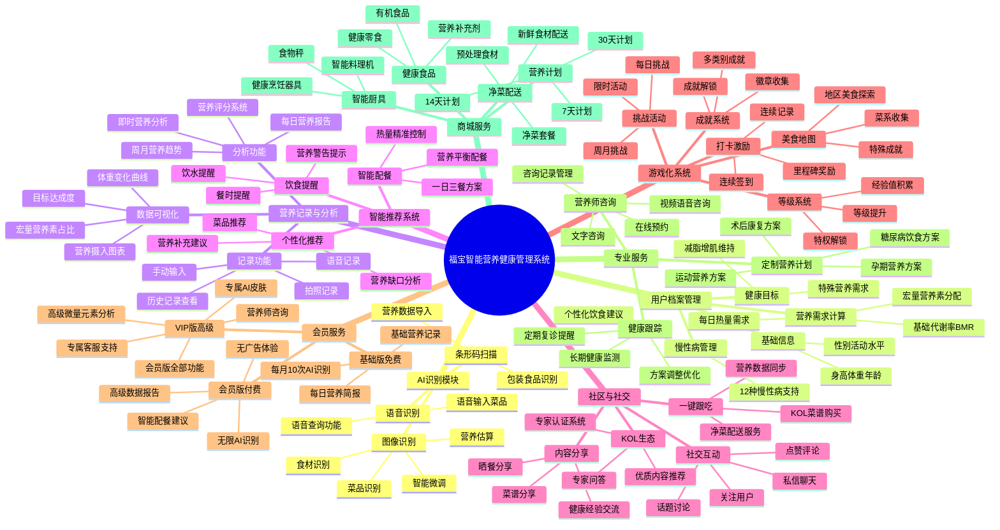

# 福宝智能营养健康管理系统 - 产品概述与功能框架

## 一、名词解释与系统概述

### 1.1 系统名称
**福宝智能营养健康管理系统**（英文名：NutriBit Intelligent Nutrition & Health Management System）

### 1.2 系统定义
福宝智能营养健康管理系统是一款基于人工智能视觉识别技术的智能营养健康管理应用系统。系统利用先进的AI图像识别算法、自然语言处理技术和大数据分析能力，为用户提供便捷的饮食记录、精准的营养分析、个性化的健康指导及社交化的健康管理服务。

### 1.3 核心技术
- **AI视觉识别技术**：基于多模态大语言模型的食物图像识别算法，能够准确识别中式菜品及其营养成分
- **智能微调系统**：创新性的用户参与式营养估算机制，通过场景选择、口味调整、份量估算等维度提升营养数据准确性
- **个性化推荐引擎**：基于用户健康档案、饮食历史和健康目标的智能推荐算法
- **游戏化激励机制**：通过等级系统、成就体系、连续打卡等方式提升用户粘性
- **Freemium会员体系**：三层会员等级（基础版、会员版、VIP版）的商业化运营模式

### 1.4 应用场景
- 个人健康管理：体重管理、营养均衡、慢性病饮食控制
- 专业健身人群：精确的营养素摄入控制、运动配餐
- 家庭营养管理：多成员健康档案管理、家庭饮食规划
- 营养师服务：在线咨询、个性化方案定制、健康跟踪指导

## 二、产品概述

### 2.1 产品背景
随着人们健康意识的提升，营养健康管理需求日益增长。传统的营养记录方式存在操作繁琐、数据不准确、缺乏个性化指导等痛点。特别是在中式饮食场景下，油盐酱醋等调料的用量难以精确计量，菜品种类繁多复杂，现有营养管理产品难以满足需求。

福宝智能营养健康管理系统针对这些痛点，创新性地采用AI视觉识别技术，让用户通过简单拍照即可完成营养记录，配合智能微调系统提升数据准确性，并提供个性化的健康指导，从而打造了一个简单、智能、有温度的健康饮食管理平台。

### 2.2 产品定位
- **核心定位**：以AI视觉识别为核心的智能营养健康管理平台
- **目标用户**：健身爱好者、减脂瘦身者、健康意识觉醒者、慢性病患者、家庭用户
- **产品愿景**：成为全球领先的、以AI视觉识别为核心的个性化健康生活方式管理平台
- **产品使命**：赋能每一个人，通过简单、智能、持续的饮食记录与引导，构建长久、可持续的健康生活

### 2.3 核心价值
1. **极简体验**：拍照即可完成营养记录，30秒完成一次完整记录流程
2. **精准识别**：专业的中式菜品营养数据库，支持10000+常见菜品识别
3. **智能微调**：创新的用户参与优化机制，将"不精准"转化为"用户参与"的亮点
4. **个性化指导**：基于个人健康档案的定制化营养建议和配餐方案
5. **社交激励**：社区分享、游戏化机制，让健康管理更有趣、更持久
6. **专业服务**：营养师在线咨询、个性化营养计划、慢性病饮食管理

### 2.4 竞争优势
1. **技术优势**：国内首款深度适配中式饮食的精准营养分析系统
2. **数据优势**：10000+中式菜品数据库，5000+食材营养成分库
3. **体验优势**：智能微调+用户参与的创新交互模式
4. **生态优势**：从内容到商品的完整服务闭环（社区-菜谱-净菜配送）
5. **商业优势**：成熟的Freemium会员体系和多元化变现模式

## 三、系统目标

### 3.1 用户目标
1. **简化营养记录流程**
   - 将传统手动输入的复杂流程简化为拍照识别
   - 记录时间从平均5分钟缩短至30秒以内
   - 降低营养管理的学习成本和使用门槛

2. **提供精准营养数据**
   - AI识别准确率达到85%以上
   - 智能微调系统提升营养估算精度
   - 建立中国最全面的中式菜品营养数据库

3. **实现个性化健康指导**
   - 基于用户健康档案（身高、体重、年龄、性别、活动水平、健康目标）计算个性化营养需求
   - 支持慢性病饮食管理（糖尿病、高血压、高血脂、痛风等12种常见慢性病）
   - 提供智能配餐建议和营养补充方案

4. **培养健康生活习惯**
   - 通过游戏化机制（等级、成就、连续打卡）提升用户粘性
   - 建立21天习惯养成计划
   - 提供持续的健康关怀和提醒

5. **构建健康社交生态**
   - 社区分享和互动功能
   - KOL专家内容生态
   - 一键跟吃功能（社交内容+净菜配送）

### 3.2 商业目标
1. **用户增长目标**
   - MVP阶段（3-6个月）：获取10万种子用户
   - 成长阶段（6-12个月）：用户规模达到100万
   - 成熟阶段（1年后）：用户规模达到500万

2. **活跃度目标**
   - 日活跃用户（DAU）比例达到30%以上
   - 用户每日记录餐食比例达到60%以上
   - 用户连续使用7天留存率达到40%以上
   - 用户连续使用30天留存率达到20%以上

3. **付费转化目标**
   - 免费用户向付费会员转化率达到5%以上
   - 会员版向VIP版升级转化率达到20%以上
   - 单用户平均月收入（ARPU）达到15元以上
   - 用户生命周期价值（LTV）达到300元以上

4. **营收目标**
   - MVP阶段：验证商业模式，实现单月收入10万元
   - 成长阶段：实现盈亏平衡，月营收达到100万元
   - 成熟阶段：实现规模化盈利，年营收达到5000万元

### 3.3 技术目标
1. **系统性能指标**
   - AI识别响应时间：≤3秒
   - 系统页面加载时间：≤2秒
   - 系统可用性：≥99.9%
   - 并发用户支持：≥10万

2. **AI识别精度**
   - 菜品识别准确率：≥85%
   - 营养估算误差率：≤15%
   - 用户满意度评分：≥4.5分（满分5分）

3. **数据安全与隐私**
   - 符合国家网络安全法和个人信息保护法要求
   - 通过信息安全等级保护三级认证
   - 用户数据加密存储和传输
   - 完善的数据备份和恢复机制

4. **技术创新与优化**
   - 持续优化AI识别算法，提升识别准确率
   - 建立用户反馈优化闭环，不断完善营养数据库
   - 探索多模态识别（图像+语音+文本）技术
   - 研发个性化推荐算法，提升推荐精准度

## 四、功能框架

### 4.1 系统功能架构图

### 4.2 核心功能模块说明

#### 4.2.1 AI识别模块
负责食物的智能识别和营养估算，是系统的核心技术模块。支持图像识别、语音识别和条形码扫描三种方式。采用深度学习算法，结合10000+中式菜品数据库和5000+食材营养成分库，实现准确的菜品识别和营养估算。

#### 4.2.2 用户档案管理模块
管理用户的基础信息、健康目标和慢性病信息，为个性化服务提供数据基础。根据用户档案自动计算个性化营养需求，包括基础代谢率（BMR）、每日热量需求、宏量营养素（蛋白质、碳水化合物、脂肪）分配比例等。

#### 4.2.3 营养记录与分析模块
提供便捷的营养记录方式和全面的营养分析功能。用户可通过拍照、手动输入、语音等多种方式记录饮食。系统自动生成营养分析报告，包括热量、蛋白质、碳水化合物、脂肪、钠、纤维等营养素的摄入情况，并与个人目标进行对比分析。

#### 4.2.4 智能推荐系统模块
基于用户健康档案、饮食历史和营养目标，提供个性化的菜品推荐、智能配餐方案和营养补充建议。分析用户的营养缺口，推荐能够弥补营养不足的食物，帮助用户实现营养均衡。

#### 4.2.5 社区与社交模块
构建健康饮食社交生态，用户可以分享餐食、交流经验、关注他人。支持KOL专家内容生态，提供一键跟吃功能，将社交内容与商品服务相结合，打造完整的服务闭环。

#### 4.2.6 游戏化系统模块
通过等级、成就、打卡、挑战等游戏化机制，提升用户参与度和粘性。用户通过记录饮食、完成挑战、达成目标等行为获得经验值和奖励，解锁各类成就徽章。

#### 4.2.7 会员服务模块
实施Freemium商业模式，提供三层会员等级：基础版（免费）、会员版（¥19.9/月）、VIP版（¥39.9/月）。不同等级享有不同的功能权限和服务体验，实现商业变现。

#### 4.2.8 专业服务模块
提供营养师在线咨询、定制营养计划、健康跟踪等专业服务。支持孕期营养、糖尿病饮食、术后康复、运动营养等特殊人群的专业方案定制。

#### 4.2.9 商城服务模块
整合供应链资源，提供净菜配送、健康食品、营养计划、智能厨具等商品和服务，打通"内容-服务-商品"的完整链条。

### 4.3 技术架构特点

1. **前后端分离架构**：前端采用React+TypeScript+Vite技术栈，后端采用微服务架构
2. **AI服务独立部署**：图像识别、自然语言处理等AI服务独立部署，支持弹性伸缩
3. **分布式存储**：采用PostgreSQL关系型数据库、MongoDB文档数据库、Redis缓存、对象存储的混合存储架构
4. **微服务架构**：按业务领域拆分为用户服务、营养服务、社区服务、支付服务等独立微服务
5. **API网关**：统一的API网关负责路由、认证、限流、监控等
6. **消息队列**：使用消息队列实现异步处理和服务解耦

---

*文档版本：v1.0*  
*编制日期：2025年10月2日*  
*编制单位：福宝智能营养健康管理系统项目组*

