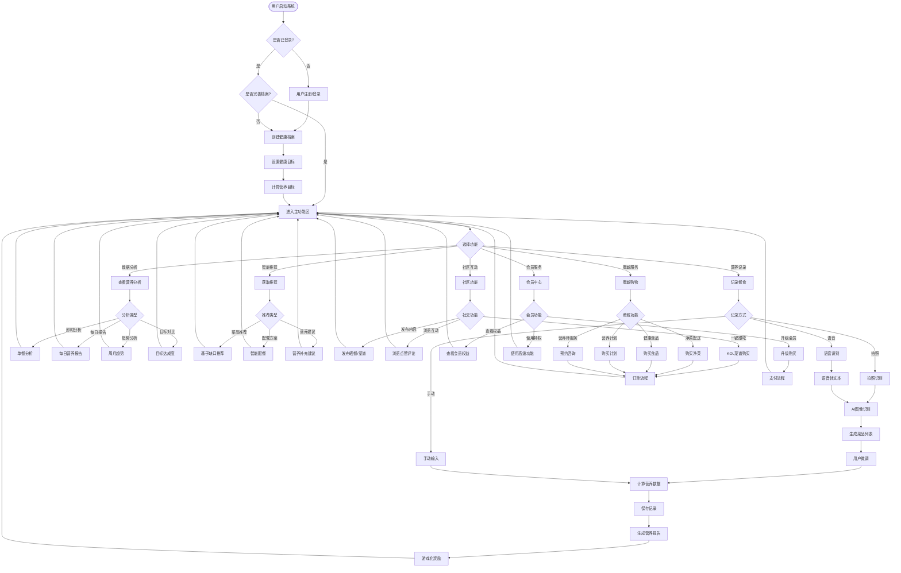
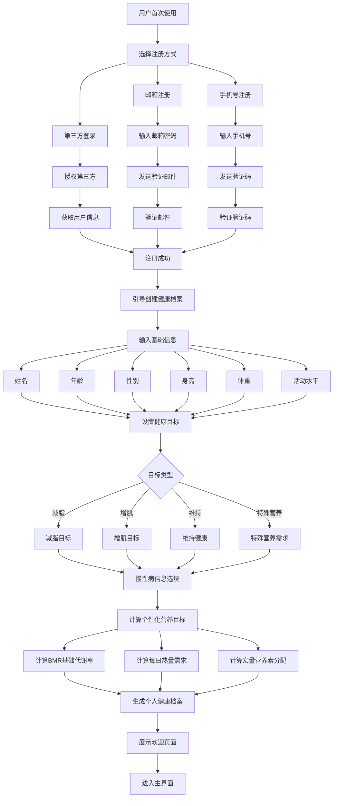
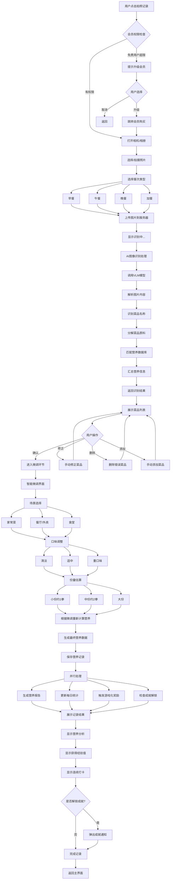
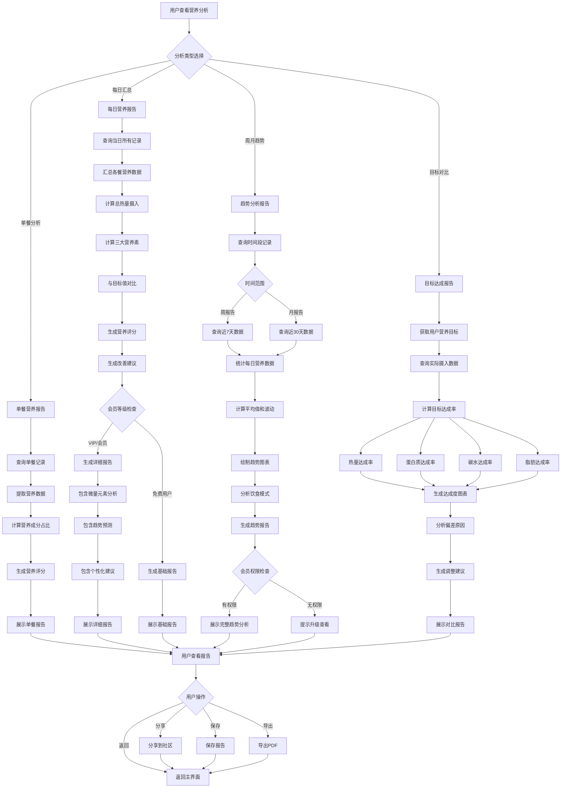
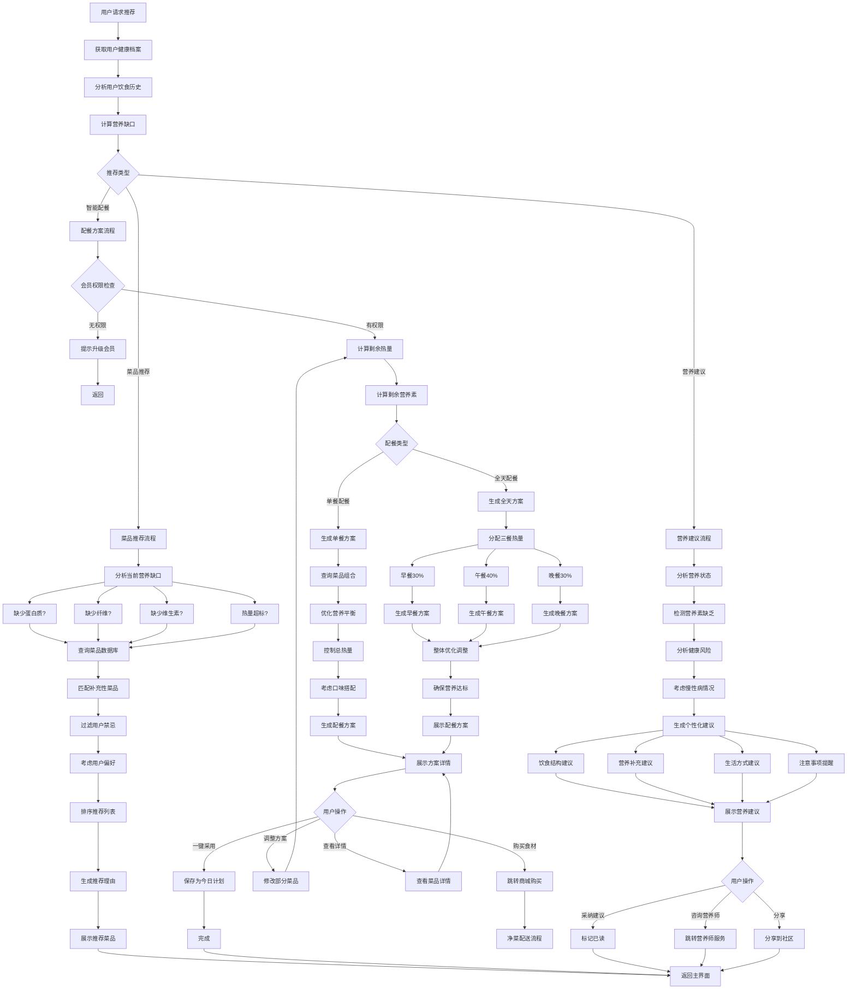
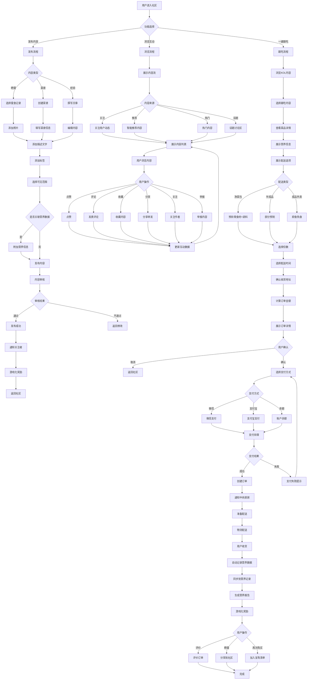
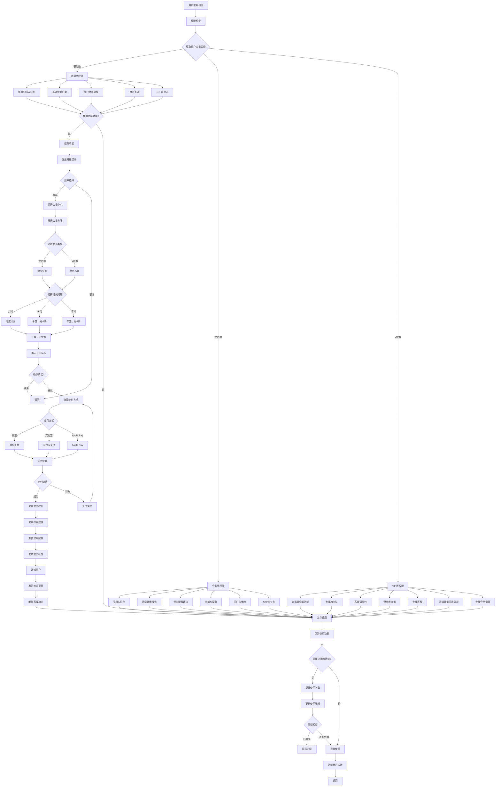
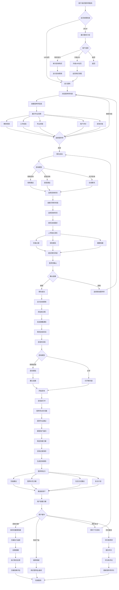
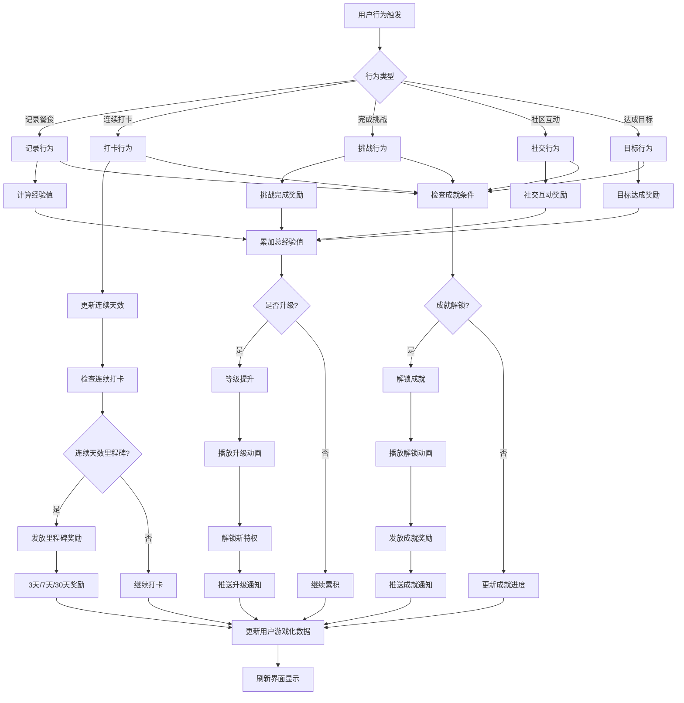
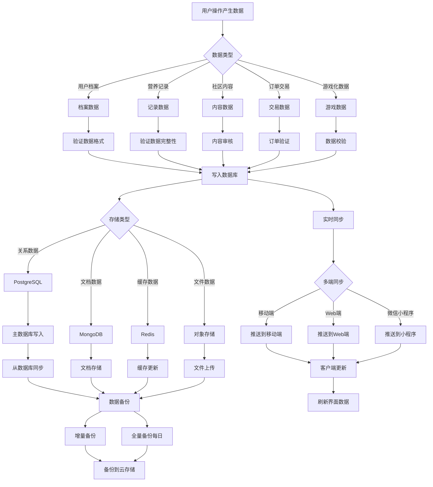

# 福宝智能营养健康管理系统 - 系统业务流程

## 一、系统总体业务流程

### 1.1 系统核心业务流程图

## 二、核心业务流程详解

### 2.1 用户注册与档案创建流程

### 2.2 AI拍照识别与营养记录流程

### 2.3 营养分析与报告生成流程

### 2.4 智能推荐与配餐流程

### 2.5 社区互动与一键跟吃流程

### 2.6 会员体系与权限管理流程

### 2.7 营养师咨询服务流程

## 三、支撑业务流程

### 3.1 游戏化奖励触发流程

### 3.2 数据同步与存储流程

---

*文档版本：v1.0*  
*编制日期：2025年10月2日*  
*编制单位：福宝智能营养健康管理系统项目组*

