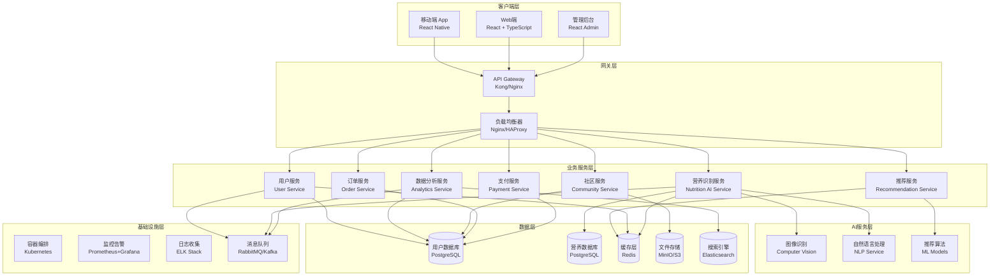
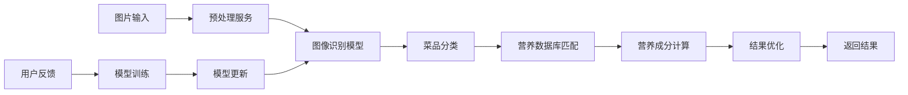
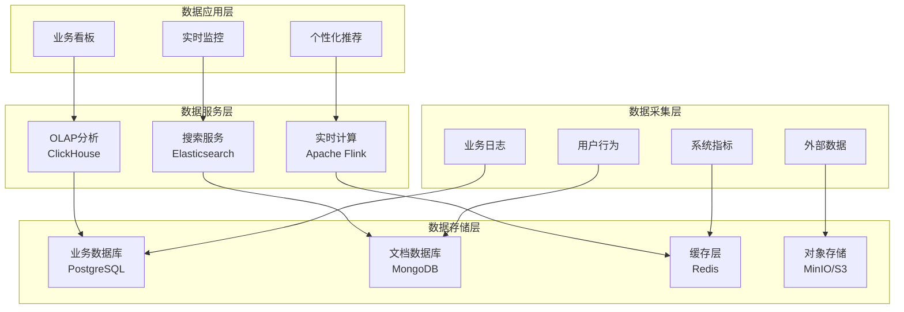
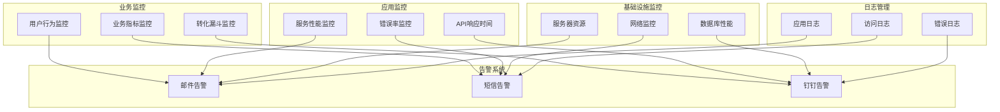

# 技术架构设计 - 食刻 (NutriBit)

## 🏗️ 整体架构概览

食刻采用微服务架构设计，支持高并发、高可用、可扩展的服务需求。



## 🎯 前端架构

### 技术栈选择
- **框架**: React 18 + TypeScript
- **构建工具**: Vite
- **样式方案**: Tailwind CSS
- **状态管理**: Zustand/Redux Toolkit
- **路由**: React Router v6
- **HTTP客户端**: Axios
- **UI组件库**: 自研组件库 + Headless UI

### 项目结构
```
src/
├── components/          # 通用组件
│   ├── ui/             # 基础UI组件
│   ├── forms/          # 表单组件
│   └── layout/         # 布局组件
├── pages/              # 页面组件
│   ├── auth/           # 认证相关页面
│   ├── dashboard/      # 仪表板
│   ├── nutrition/      # 营养相关页面
│   └── community/      # 社区页面
├── hooks/              # 自定义Hooks
├── services/           # API服务
├── stores/             # 状态管理
├── types/              # TypeScript类型定义
├── utils/              # 工具函数
└── assets/             # 静态资源
```

### 状态管理策略
- **全局状态**: 用户信息、应用设置
- **页面状态**: 页面级别的业务状态
- **组件状态**: 组件内部UI状态
- **服务端状态**: React Query管理API数据

### 性能优化策略
1. **代码分割**: 基于路由的懒加载
2. **组件优化**: React.memo、useMemo、useCallback
3. **图片优化**: WebP格式、懒加载、响应式图片
4. **缓存策略**: Service Worker、HTTP缓存
5. **Bundle优化**: Tree-shaking、动态导入

## ⚙️ 后端架构

### 微服务设计原则
1. **单一职责**: 每个服务专注特定业务领域
2. **独立部署**: 服务间松耦合，可独立扩展
3. **数据隔离**: 每个服务拥有独立数据存储
4. **接口标准**: RESTful API + GraphQL

### 核心服务模块

#### 1. 用户服务 (User Service)
- **技术栈**: Node.js + Express + TypeScript
- **职责**: 用户注册、登录、个人信息管理
- **数据库**: PostgreSQL
- **特性**: JWT认证、OAuth2.0集成

#### 2. 营养识别服务 (Nutrition AI Service)
- **技术栈**: Python + FastAPI
- **职责**: 图像识别、营养分析、数据处理
- **AI模型**: 
  - 视觉识别模型 (Computer Vision)
  - 营养成分推算模型
  - 中式菜品识别模型
- **数据库**: PostgreSQL (营养数据库)

#### 3. 推荐服务 (Recommendation Service)
- **技术栈**: Python + FastAPI
- **职责**: 个性化推荐、智能配餐
- **算法**: 
  - 协同过滤
  - 内容推荐
  - 深度学习推荐模型
- **缓存**: Redis

#### 4. 数据分析服务 (Analytics Service)
- **技术栈**: Python + FastAPI
- **职责**: 数据统计、报告生成、趋势分析
- **工具**: Pandas、NumPy、Matplotlib
- **存储**: ClickHouse (时序数据)

#### 5. 社区服务 (Community Service)
- **技术栈**: Node.js + Express
- **职责**: 内容发布、社交功能、互动管理
- **特性**: 实时通讯、内容审核
- **存储**: MongoDB (非结构化数据)

#### 6. 订单服务 (Order Service)
- **技术栈**: Java + Spring Boot
- **职责**: 订单管理、库存管理、配送跟踪
- **模式**: 事务管理、状态机
- **数据库**: PostgreSQL

#### 7. 支付服务 (Payment Service)
- **技术栈**: Java + Spring Boot
- **职责**: 支付处理、账单管理、退款处理
- **集成**: 微信支付、支付宝、银联
- **安全**: PCI DSS合规

### API设计规范

#### RESTful API标准
```typescript
// 统一响应格式
interface ApiResponse<T> {
  code: number;
  message: string;
  data: T;
  timestamp: number;
  requestId: string;
}

// 错误处理
interface ApiError {
  code: number;
  message: string;
  details?: any;
}
```

#### GraphQL Schema示例
```graphql
type User {
  id: ID!
  username: String!
  email: String!
  profile: UserProfile
  nutritionRecords: [NutritionRecord!]!
}

type NutritionRecord {
  id: ID!
  mealTime: DateTime!
  foods: [Food!]!
  totalCalories: Float!
  macronutrients: Macronutrients!
}

type Query {
  me: User
  nutritionRecord(id: ID!): NutritionRecord
  dailyNutritionSummary(date: Date!): NutritionSummary
}

type Mutation {
  createNutritionRecord(input: NutritionRecordInput!): NutritionRecord!
  updateUserProfile(input: UserProfileInput!): User!
}
```

## 🤖 AI/ML架构

### 模型服务架构


### 核心AI模型

#### 1. 图像识别模型
- **架构**: ResNet50 + 自定义分类头
- **训练数据**: 10万+ 中式菜品图片
- **准确率**: >85% (Top-1), >95% (Top-5)
- **部署**: TensorFlow Serving + Docker

#### 2. 营养成分推算模型
- **类型**: 机器学习回归模型
- **特征**: 菜品类别、重量、烹饪方式、调料
- **算法**: Random Forest + Neural Network
- **精度**: MAPE < 15%

#### 3. 个性化推荐模型
- **架构**: 深度学习推荐系统
- **算法**: DeepFM + Wide & Deep
- **特征**: 用户画像、历史行为、营养偏好
- **实时性**: 毫秒级推理

### 模型训练与部署流程

#### 训练流程
1. **数据收集**: 用户上传图片 + 专业标注
2. **数据预处理**: 图片增强、标签清洗
3. **模型训练**: 分布式训练、超参数调优
4. **模型评估**: A/B测试、离线评估
5. **模型部署**: 灰度发布、性能监控

#### 部署架构
- **模型服务**: TensorFlow Serving
- **负载均衡**: Kubernetes Service
- **资源管理**: GPU节点池
- **监控**: Prometheus + Custom Metrics

## 💾 数据架构

### 数据分层设计


### 数据库设计

#### 用户数据库 (PostgreSQL)
```sql
-- 用户基础信息表
CREATE TABLE users (
    id SERIAL PRIMARY KEY,
    username VARCHAR(50) UNIQUE NOT NULL,
    email VARCHAR(100) UNIQUE NOT NULL,
    phone VARCHAR(20),
    created_at TIMESTAMP DEFAULT CURRENT_TIMESTAMP,
    updated_at TIMESTAMP DEFAULT CURRENT_TIMESTAMP
);

-- 用户健康档案表
CREATE TABLE user_profiles (
    id SERIAL PRIMARY KEY,
    user_id INTEGER REFERENCES users(id),
    height DECIMAL(5,2),
    weight DECIMAL(5,2),
    age INTEGER,
    gender VARCHAR(10),
    activity_level VARCHAR(20),
    health_goal VARCHAR(50),
    created_at TIMESTAMP DEFAULT CURRENT_TIMESTAMP,
    updated_at TIMESTAMP DEFAULT CURRENT_TIMESTAMP
);

-- 营养记录表
CREATE TABLE nutrition_records (
    id SERIAL PRIMARY KEY,
    user_id INTEGER REFERENCES users(id),
    meal_time TIMESTAMP NOT NULL,
    meal_type VARCHAR(20), -- breakfast, lunch, dinner, snack
    total_calories DECIMAL(8,2),
    total_protein DECIMAL(8,2),
    total_carbs DECIMAL(8,2),
    total_fat DECIMAL(8,2),
    created_at TIMESTAMP DEFAULT CURRENT_TIMESTAMP
);
```

#### 营养数据库 (PostgreSQL)
```sql
-- 食物基础信息表
CREATE TABLE foods (
    id SERIAL PRIMARY KEY,
    name VARCHAR(100) NOT NULL,
    category VARCHAR(50),
    description TEXT,
    created_at TIMESTAMP DEFAULT CURRENT_TIMESTAMP
);

-- 食物营养成分表 (每100g)
CREATE TABLE food_nutrition (
    id SERIAL PRIMARY KEY,
    food_id INTEGER REFERENCES foods(id),
    calories DECIMAL(8,2) NOT NULL,
    protein DECIMAL(8,2) NOT NULL,
    carbohydrates DECIMAL(8,2) NOT NULL,
    fat DECIMAL(8,2) NOT NULL,
    fiber DECIMAL(8,2),
    sodium DECIMAL(8,2),
    -- 其他微量元素...
    created_at TIMESTAMP DEFAULT CURRENT_TIMESTAMP
);
```

### 缓存策略
- **Redis Cluster**: 分布式缓存
- **缓存模式**: Cache-Aside + Write-Through
- **过期策略**: TTL + LRU
- **数据类型**: String、Hash、List、Set、ZSet

### 数据备份与恢复
- **备份策略**: 全量备份(每日) + 增量备份(每小时)
- **异地备份**: 主备机房数据同步
- **恢复测试**: 定期恢复演练
- **RPO/RTO**: RPO < 1小时, RTO < 30分钟

## 🔒 安全架构

### 认证与授权
- **认证方式**: JWT + Refresh Token
- **授权模型**: RBAC (基于角色的访问控制)
- **会话管理**: Redis存储会话状态
- **多因子认证**: SMS、邮箱、第三方登录

### 数据安全
- **传输加密**: HTTPS/TLS 1.3
- **存储加密**: AES-256数据库字段加密
- **敏感数据**: 脱敏处理、访问审计
- **备份加密**: 备份文件加密存储

### API安全
- **请求限制**: Rate Limiting
- **参数验证**: 输入验证、SQL注入防护
- **CORS配置**: 跨域请求控制
- **API密钥**: 第三方服务认证

### 隐私保护
- **GDPR合规**: 数据最小化、用户同意
- **数据脱敏**: 日志脱敏、测试数据脱敏
- **访问控制**: 最小权限原则
- **审计日志**: 敏感操作审计

## 📊 监控与运维

### 监控体系


### 关键指标
- **可用性**: 服务正常运行时间 > 99.9%
- **性能**: API响应时间 < 200ms (P95)
- **容量**: 支持10万并发用户
- **准确性**: AI识别准确率 > 85%

### 部署策略
- **容器化**: Docker + Kubernetes
- **CI/CD**: GitLab CI + ArgoCD
- **发布策略**: 蓝绿部署、滚动更新
- **环境管理**: Dev/Test/Staging/Prod

## 🚀 扩展性设计

### 水平扩展
- **无状态服务**: 应用层无状态设计
- **数据库分片**: 按用户ID分片
- **缓存分布**: Redis Cluster
- **负载均衡**: 多层负载均衡

### 垂直扩展
- **服务拆分**: 按业务域拆分微服务
- **数据库优化**: 读写分离、索引优化
- **缓存优化**: 多级缓存策略
- **计算优化**: GPU加速、异步处理

### 国际化支持
- **多语言**: i18n国际化框架
- **多时区**: 时区转换处理
- **多币种**: 货币换算支持
- **本地化**: 文化差异适配

---

*文档版本: v1.0*  
*最后更新: 2025年9月10日*
