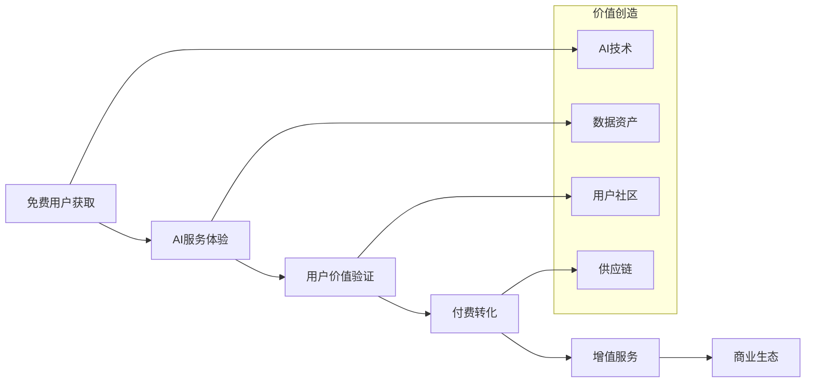

# 商业模式 - 福宝 (NutriBit)

## 💡 商业模式概览

福宝采用多元化的混合商业模式，通过"免费基础服务 + 增值订阅 + 电商闭环 + 专业服务"的组合策略，构建可持续的盈利体系。

### 核心商业逻辑


## 💰 收入模式详解

### 1. Freemium订阅模式 (40%收入占比)

#### 1.1 免费版功能
- **基础AI识别**: 每日5次免费识别
- **营养记录**: 基础营养数据记录
- **简单分析**: 每日营养摄入报告
- **社区浏览**: 查看社区内容(限制互动)

#### 1.2 付费订阅方案
```typescript
interface SubscriptionPlans {
  basic: {
    name: "营养管家";
    price: 19; // 元/月
    features: [
      "无限次AI识别",
      "高级营养分析",
      "个性化推荐",
      "社区完整功能",
      "数据导出"
    ];
    target: "普通健康意识用户";
  };
  
  premium: {
    name: "AI营养师";
    price: 39; // 元/月
    features: [
      "Basic全部功能",
      "AI营养师对话",
      "深度健康分析",
      "专属菜谱库",
      "优先客服支持",
      "健康数据同步"
    ];
    target: "健身爱好者、减脂人群";
  };
  
  professional: {
    name: "专业版";
    price: 99; // 元/月
    features: [
      "Premium全部功能",
      "营养师咨询(2次/月)",
      "定制化方案",
      "专业报告",
      "企业功能",
      "API接口"
    ];
    target: "专业人士、企业用户";
  };
}
```

#### 1.3 订阅转化策略
- **免费试用**: 7天Premium免费体验
- **限时优惠**: 首月5折优惠
- **年付折扣**: 年付享受2个月免费
- **推荐奖励**: 邀请好友送会员时长
- **学生优惠**: 学生认证享受5折优惠

### 2. 一键跟吃电商模式 (35%收入占比)

#### 2.1 商品类型与定价
```typescript
interface ProductCategories {
  ingredientKits: {
    name: "净菜包";
    priceRange: [25, 80]; // 元
    description: "预处理食材 + 调料包";
    margin: 0.35; // 35%毛利率
    targetUsers: "享受烹饪过程的用户";
  };
  
  readyMeals: {
    name: "即食健康餐";
    priceRange: [35, 120]; // 元
    description: "成品健康餐食";
    margin: 0.45; // 45%毛利率
    targetUsers: "追求便利的忙碌人群";
  };
  
  subscriptionBoxes: {
    name: "订阅套餐";
    priceRange: [299, 899]; // 元/月
    description: "包月健康饮食解决方案";
    margin: 0.40; // 40%毛利率
    targetUsers: "深度用户、企业客户";
  };
}
```

#### 2.2 KOL合作分成模式
- **销售分成**: KOL获得销售额的15-25%
- **阶梯奖励**: 月销售额越高，分成比例越高
- **独家合作**: 专属KOL享受更高分成比例
- **内容奖励**: 优质内容额外奖励500-2000元

#### 2.3 供应链成本控制
```typescript
interface SupplyChainCosts {
  rawMaterials: 0.35;      // 原材料成本35%
  processing: 0.15;        // 加工成本15%
  packaging: 0.05;         // 包装成本5%
  logistics: 0.12;         // 物流成本12%
  platform: 0.08;         // 平台运营8%
  grossMargin: 0.25;       // 毛利润25%
}
```

### 3. 专业服务模式 (15%收入占比)

#### 3.1 营养师咨询服务
- **单次咨询**: 199元/次 (30分钟)
- **包月服务**: 599元/月 (4次咨询 + 方案制定)
- **深度服务**: 1999元/季度 (专属营养师 + 全程跟踪)
- **平台抽成**: 30%服务费

#### 3.2 企业级服务
```typescript
interface EnterpriseServices {
  employeeWellness: {
    name: "员工健康管理";
    pricing: "50元/人/月";
    features: [
      "团体营养分析",
      "食堂菜谱优化",
      "健康数据报告",
      "专属客服支持"
    ];
  };
  
  corporateCanteen: {
    name: "企业食堂解决方案";
    pricing: "按需定制";
    features: [
      "菜谱营养优化",
      "食材采购建议",
      "营养师驻场",
      "员工满意度追踪"
    ];
  };
}
```

### 4. 数据与广告模式 (10%收入占比)

#### 4.1 精准广告投放
- **品牌合作**: 健康食品品牌原生广告
- **精准推送**: 基于用户画像的个性化广告
- **效果营销**: CPC/CPM/CPA多种计费模式
- **内容营销**: 软文、测评、直播带货

#### 4.2 数据洞察服务
```typescript
interface DataInsights {
  marketResearch: {
    name: "消费趋势洞察";
    price: "10万-50万元/年";
    target: "食品行业、餐饮连锁";
    deliverables: [
      "用户饮食偏好分析",
      "营养需求趋势报告",
      "产品机会识别",
      "竞品分析报告"
    ];
  };
  
  productDevelopment: {
    name: "产品研发支持";
    price: "按项目定价";
    target: "食品制造商";
    deliverables: [
      "新品口味测试",
      "营养配方优化",
      "市场接受度评估",
      "定价策略建议"
    ];
  };
}
```

## 📊 财务模型预测

### 用户增长预测
```typescript
interface UserGrowthProjection {
  year1: {
    totalUsers: 100000;
    paidUsers: 5000;      // 5%付费转化率
    arpu: 180;            // 年均付费180元
    ecommereUsers: 2000;  // 2%电商转化率
    avgOrderValue: 450;   // 平均订单价值450元
  };
  
  year2: {
    totalUsers: 500000;
    paidUsers: 35000;     // 7%付费转化率
    arpu: 240;           // 年均付费240元
    ecommereUsers: 15000; // 3%电商转化率
    avgOrderValue: 520;   // 平均订单价值520元
  };
  
  year3: {
    totalUsers: 2000000;
    paidUsers: 200000;    // 10%付费转化率
    arpu: 300;           // 年均付费300元
    ecommereUsers: 100000; // 5%电商转化率
    avgOrderValue: 600;   // 平均订单价值600元
  };
}
```

### 收入结构预测
| 年份 | 订阅收入 | 电商收入 | 专业服务 | 广告收入 | 总收入 |
|------|----------|----------|----------|----------|--------|
| Year 1 | 90万 | 180万 | 30万 | 20万 | 320万 |
| Year 2 | 840万 | 1560万 | 200万 | 150万 | 2750万 |
| Year 3 | 6000万 | 12000万 | 1000万 | 800万 | 19800万 |

### 成本结构分析
```typescript
interface CostStructure {
  technology: {
    percentage: 0.25;
    items: ["研发人员", "AI模型训练", "云服务", "技术基础设施"];
  };
  
  operations: {
    percentage: 0.30;
    items: ["供应链管理", "物流配送", "客服支持", "质量控制"];
  };
  
  marketing: {
    percentage: 0.20;
    items: ["用户获取", "品牌推广", "KOL合作", "内容运营"];
  };
  
  administration: {
    percentage: 0.15;
    items: ["管理团队", "财务法务", "办公成本", "其他费用"];
  };
  
  grossMargin: 0.10; // 净利润率10%
}
```

## 🎯 商业策略规划

### 第一阶段：市场验证 (0-12个月)
**目标**: 验证产品市场契合度，获取种子用户

#### 策略重点
1. **免费策略**: 大量免费功能获取用户
2. **口碑营销**: 通过优质体验获得自然传播
3. **KOL合作**: 与健身、美食领域KOL深度合作
4. **社群运营**: 建立核心用户社群

#### 关键指标
- **用户增长**: 月增长率 >30%
- **用户活跃**: DAU/MAU >30%
- **产品满意度**: NPS >50
- **付费转化**: 试用转付费 >3%

### 第二阶段：规模扩张 (12-24个月)
**目标**: 快速扩大用户规模，建立竞争优势

#### 策略重点
1. **付费推广**: 精准广告投放获取用户
2. **渠道拓展**: 多渠道分发扩大覆盖
3. **功能丰富**: 增加订阅服务价值
4. **供应链建设**: 搭建电商服务能力

#### 关键指标
- **用户规模**: 突破50万注册用户
- **付费用户**: 付费用户超过3万
- **收入增长**: 月收入增长率 >50%
- **市场份额**: 在细分市场占有率 >10%

### 第三阶段：生态构建 (24-36个月)
**目标**: 构建完整商业生态，实现盈利

#### 策略重点
1. **生态完善**: 打通营养管理全链条
2. **数据变现**: 基于数据资产的商业化
3. **B端拓展**: 企业服务快速增长
4. **品牌建设**: 成为行业领导品牌

#### 关键指标
- **用户价值**: LTV/CAC >3
- **收入多元**: 非订阅收入占比 >60%
- **市场地位**: 成为行业前三品牌
- **盈利能力**: 实现规模化盈利

## 💡 创新商业模式

### 1. "数字营养师"订阅制
**概念**: AI营养师 + 真人营养师的混合服务模式
```typescript
interface HybridNutritionistModel {
  aiComponent: {
    available: "7×24小时";
    capabilities: ["即时问答", "数据分析", "趋势预测"];
    cost: "边际成本接近0";
  };
  
  humanComponent: {
    available: "工作时间";
    capabilities: ["深度咨询", "个性化方案", "情感支持"];
    cost: "按需安排，成本可控";
  };
  
  value: "专业服务平民化，高频触达降低获客成本";
}
```

### 2. "健康饮食元宇宙"
**概念**: VR/AR技术结合营养教育和社交体验
- **虚拟厨房**: 3D烹饪教学
- **营养可视化**: AR展示食物营养成分
- **社交用餐**: 虚拟空间共同用餐
- **游戏化学习**: 营养知识游戏化

### 3. "营养数据银行"
**概念**: 用户营养数据资产化和价值化
```typescript
interface NutritionDataBank {
  userBenefits: [
    "数据所有权确认",
    "数据使用收益分成",
    "个人营养信用体系",
    "保险费率优化"
  ];
  
  businessValue: [
    "匿名化数据研究",
    "产品研发支持",
    "市场趋势分析",
    "健康风险评估"
  ];
  
  implementation: {
    technology: "区块链 + 隐私计算";
    governance: "用户授权 + 监管合规";
    revenue: "数据使用费 + 平台服务费";
  };
}
```

## 🚀 商业化路径

### 短期商业化 (6-18个月)
1. **订阅服务**: 快速实现付费转化
2. **电商GMV**: 建立交易闭环
3. **广告收入**: 精准营销变现
4. **会员权益**: 增值服务差异化

### 中期商业化 (18-36个月)
1. **B端服务**: 企业级市场拓展
2. **专业服务**: 高客单价服务
3. **平台佣金**: 第三方服务抽成
4. **数据服务**: 数据洞察商业化

### 长期商业化 (36个月后)
1. **生态平台**: 成为健康生活平台
2. **金融服务**: 健康相关金融产品
3. **国际化**: 出海复制商业模式
4. **产业投资**: 投资相关产业链

## 📈 竞争优势与护城河

### 技术护城河
1. **AI模型**: 中式饮食识别专业模型
2. **数据资产**: 大量用户营养数据
3. **算法优势**: 个性化推荐算法
4. **技术积累**: 深度学习技术沉淀

### 商业护城河
1. **网络效应**: 用户和KOL双边网络
2. **品牌认知**: 专业营养管理品牌
3. **供应链**: 垂直整合供应链能力
4. **用户粘性**: 高频使用的健康习惯

### 数据护城河
1. **用户画像**: 精准的用户营养画像
2. **行为数据**: 长期饮食行为数据
3. **效果数据**: 营养干预效果验证
4. **市场洞察**: 深度的市场趋势数据

## 🎲 风险评估与应对

### 商业风险
1. **市场竞争**: 大厂入局竞争加剧
   - **应对**: 深化技术护城河，建立品牌优势
2. **用户获取**: 获客成本持续上升
   - **应对**: 提升产品粘性，增强口碑传播
3. **供应链**: 食品安全和质量控制
   - **应对**: 建立严格质控体系，保险保障

### 技术风险
1. **AI准确性**: 识别准确率不达预期
   - **应对**: 持续优化模型，人工校验机制
2. **数据安全**: 用户隐私和数据泄露
   - **应对**: 加强安全防护，合规管理

### 政策风险
1. **食品监管**: 食品安全法规变化
   - **应对**: 积极配合监管，建立合规体系
2. **数据保护**: 个人信息保护法规
   - **应对**: 严格遵守法规，透明使用政策

---

*文档版本: v1.0*  
*最后更新: 2025年9月10日*
