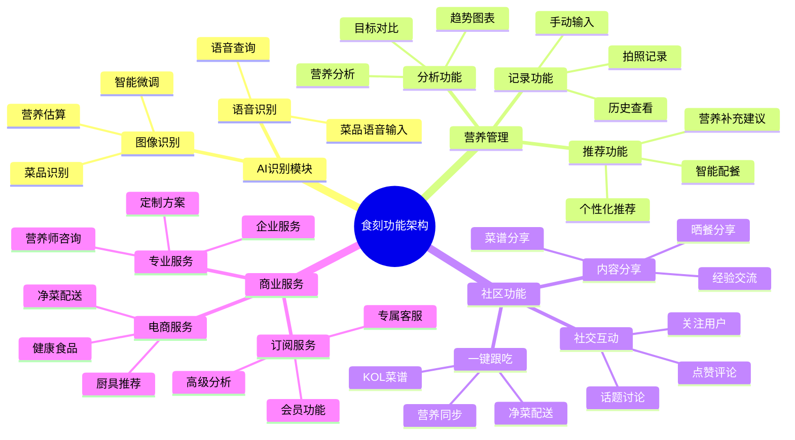
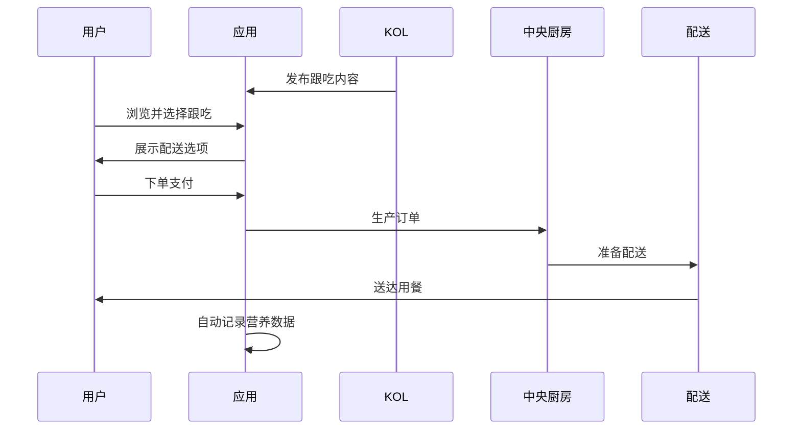

# 功能规划 - 食刻 (NutriBit)

## 🎯 功能概览

食刻作为智能营养健康管理平台，围绕"AI识别→精准记录→个性化指导→社交分享→商业闭环"的核心路径，构建了完整的功能生态。

## 📊 功能架构图



## 🚀 MVP阶段功能 (3-6个月)

### 1. 用户认证与档案管理

#### 1.1 注册登录
- **邮箱注册**: 支持邮箱验证注册
- **手机注册**: 短信验证码登录
- **第三方登录**: 微信、支付宝、Apple ID
- **找回密码**: 邮箱/短信重置密码

#### 1.2 个人档案
```typescript
interface UserProfile {
  basicInfo: {
    height: number;          // 身高 (cm)
    weight: number;          // 体重 (kg)
    age: number;             // 年龄
    gender: 'male' | 'female' | 'other';
  };
  healthGoals: {
    targetWeight?: number;   // 目标体重
    goal: 'lose' | 'gain' | 'maintain';  // 健康目标
    timeline: number;        // 目标时间 (月)
  };
  lifestyle: {
    activityLevel: 'low' | 'moderate' | 'high';
    sleepHours: number;      // 平均睡眠时长
    workType: 'sedentary' | 'active' | 'physical';
  };
  preferences: {
    dietType?: 'normal' | 'vegetarian' | 'vegan' | 'keto';
    allergies: string[];     // 过敏食物
    dislikes: string[];      // 不喜欢的食物
  };
}
```

#### 1.3 营养目标计算
基于用户档案自动计算个人营养需求：
- **基础代谢率**: Harris-Benedict公式
- **每日热量需求**: BMR × 活动系数
- **宏量营养素分配**: 蛋白质、碳水化合物、脂肪比例
- **微量元素需求**: 维生素、矿物质推荐量

### 2. AI图像识别与营养分析

#### 2.1 核心识别功能
- **单菜品识别**: 识别准确率 >85%
- **复合菜品识别**: 支持一盘多菜识别
- **重量估算**: 基于参照物估算食物重量
- **置信度评估**: 提供识别结果置信度

#### 2.2 智能微调系统
```typescript
interface AdjustmentOptions {
  cookingStyle: {
    venue: 'home' | 'restaurant' | 'canteen';
    method: 'steamed' | 'fried' | 'boiled' | 'grilled';
  };
  taste: {
    saltiness: 'light' | 'normal' | 'heavy';
    oiliness: 'light' | 'normal' | 'heavy';
    sweetness: 'none' | 'light' | 'normal' | 'heavy';
  };
  portion: {
    size: 'small' | 'medium' | 'large';
    reference: string;  // 参考物描述
  };
}
```

#### 2.3 营养数据库
- **中式菜品库**: 10000+ 常见菜品
- **原料数据库**: 5000+ 食材营养成分
- **调料数据库**: 100+ 常见调料营养信息
- **品牌食品库**: 1000+ 包装食品数据

### 3. 营养记录与分析

#### 3.1 记录功能
- **拍照记录**: 主要记录方式
- **语音记录**: "我刚吃了一碗牛肉面"
- **手动输入**: 精确营养数据输入
- **条形码扫描**: 包装食品快速录入
- **餐次管理**: 早餐、午餐、晚餐、加餐分类

#### 3.2 营养分析报告
```typescript
interface NutritionReport {
  daily: {
    calories: { consumed: number; target: number; };
    macronutrients: {
      protein: { consumed: number; target: number; percentage: number; };
      carbs: { consumed: number; target: number; percentage: number; };
      fat: { consumed: number; target: number; percentage: number; };
    };
    micronutrients: {
      vitamins: Record<string, { consumed: number; target: number; }>;
      minerals: Record<string, { consumed: number; target: number; }>;
    };
    score: number;  // 营养评分 0-100
  };
  analysis: {
    highlights: string[];  // 亮点
    suggestions: string[]; // 改进建议
    warnings: string[];    // 注意事项
  };
}
```

#### 3.3 趋势分析
- **体重趋势**: 体重变化曲线
- **营养趋势**: 各营养素摄入趋势
- **饮食模式**: 饮食习惯分析
- **目标达成**: 健康目标完成度

### 4. 基础推荐功能

#### 4.1 每日建议
- **营养缺口提醒**: 缺少的营养素
- **菜品推荐**: 基于营养缺口推荐菜品
- **饮水提醒**: 根据体重和活动量提醒
- **运动建议**: 基于热量盈余/不足建议运动

#### 4.2 智能配餐（基础版）
- **一日三餐**: 自动生成营养均衡的菜谱
- **营养平衡**: 确保各营养素达标
- **口味适配**: 基于用户偏好调整
- **热量控制**: 根据目标控制总热量

## 🌟 功能深化阶段 (6-12个月)

### 1. 高级营养分析

#### 1.1 深度分析功能
- **血糖指数分析**: GI值评估
- **抗炎指数**: 食物抗炎性评估
- **酸碱平衡**: 食物酸碱性分析
- **消化负担**: 消化难易度评估

#### 1.2 个性化算法
```typescript
interface PersonalizedAlgorithm {
  userModel: {
    metabolismRate: number;     // 代谢速率
    absorptionEfficiency: number; // 吸收效率
    insulinSensitivity: number;  // 胰岛素敏感性
  };
  adaptiveTargets: {
    calorieAdjustment: number;   // 热量目标调整
    macroRatioOptimization: object; // 宏量比例优化
    timingRecommendation: object;   // 进餐时间建议
  };
}
```

### 2. AI营养师功能

#### 2.1 智能对话
- **自然语言交互**: "我今天吃得怎么样？"
- **个性化回答**: 基于用户历史的定制回复
- **营养建议**: 专业营养指导
- **健康科普**: 营养知识普及

#### 2.2 主动关怀
- **健康提醒**: 营养不均衡警告
- **习惯培养**: 21天挑战计划
- **节日调整**: 节假日饮食建议
- **季节性建议**: 春夏秋冬饮食调整

### 3. 社区生态

#### 3.1 内容分享
```typescript
interface PostContent {
  type: 'meal' | 'recipe' | 'tip' | 'question';
  media: {
    images: string[];
    video?: string;
  };
  nutrition?: NutritionData;
  recipe?: RecipeData;
  location?: LocationInfo;
  mood?: 'happy' | 'satisfied' | 'guilty' | 'proud';
  tags: string[];
}
```

#### 3.2 社交功能
- **关注系统**: 关注感兴趣的用户
- **互动功能**: 点赞、评论、转发
- **私信聊天**: 用户间交流
- **群组功能**: 兴趣群组讨论

#### 3.3 KOL生态
- **认证系统**: 营养师、健身教练认证
- **内容审核**: 专业内容质量保证
- **激励机制**: 优质内容奖励
- **商业化支持**: KOL变现渠道

### 4. 一键跟吃功能

#### 4.1 核心流程


#### 4.2 配送选项
- **净菜包**: 预处理食材 + 调料包
- **半成品**: 部分预制，简单加工
- **成品外卖**: 即食热食
- **套餐组合**: 一日三餐组合

## 🚀 生态拓展阶段 (1年后)

### 1. 健康数据平台

#### 1.1 数据整合
- **智能设备连接**: 体脂秤、手环、血糖仪
- **第三方平台**: Apple Health、华为运动健康
- **医疗数据**: 体检报告、血液指标
- **基因数据**: 营养代谢基因分析

#### 1.2 全面健康评估
```typescript
interface HealthAssessment {
  nutritionalStatus: {
    deficiencies: string[];    // 营养缺乏
    excesses: string[];        // 营养过剩
    balance: number;           // 营养平衡度
  };
  metabolicHealth: {
    bloodSugar: 'optimal' | 'warning' | 'risk';
    lipidProfile: 'optimal' | 'warning' | 'risk';
    inflammation: 'low' | 'moderate' | 'high';
  };
  recommendations: {
    dietary: string[];         // 饮食建议
    lifestyle: string[];       // 生活方式建议
    medical: string[];         // 医疗建议
  };
}
```

### 2. 专业服务平台

#### 2.1 营养师服务
- **在线咨询**: 一对一营养师咨询
- **方案定制**: 个性化营养方案
- **跟踪指导**: 长期健康跟踪
- **群体服务**: 家庭/企业营养服务

#### 2.2 医疗级功能
- **慢病管理**: 糖尿病、高血压饮食管理
- **康复营养**: 术后、产后营养恢复
- **特殊人群**: 孕妇、儿童、老人专属方案
- **运动营养**: 专业运动员营养指导

### 3. 商业生态闭环

#### 3.1 供应链整合
- **农场直采**: 有机食材溯源
- **食品加工**: 健康食品研发生产
- **冷链物流**: 全程温控配送
- **品质控制**: 严格的质量管理体系

#### 3.2 新零售模式
- **线上商城**: 健康食品电商
- **线下门店**: 体验店 + 自提点
- **智能货柜**: 办公楼宇健康食品售卖
- **会员制**: 订阅式健康饮食服务

## 📊 功能优先级矩阵

| 功能模块 | 用户价值 | 实现难度 | 商业价值 | 优先级 |
|---------|---------|---------|----------|--------|
| AI图像识别 | 高 | 高 | 高 | P0 |
| 营养记录分析 | 高 | 中 | 中 | P0 |
| 个人档案管理 | 高 | 低 | 中 | P0 |
| 智能推荐 | 中 | 中 | 高 | P1 |
| 社区功能 | 中 | 中 | 高 | P1 |
| 一键跟吃 | 高 | 高 | 高 | P1 |
| AI营养师对话 | 中 | 高 | 中 | P2 |
| 专业服务 | 中 | 中 | 高 | P2 |
| 健康数据整合 | 低 | 高 | 中 | P3 |
| 供应链服务 | 中 | 高 | 高 | P3 |

## 🎯 关键指标定义

### 产品指标
- **DAU**: 日活跃用户数
- **记录率**: 用户每日记录餐食比例
- **识别准确率**: AI识别结果准确性
- **用户满意度**: NPS评分

### 商业指标
- **付费转化率**: 免费用户转付费比例
- **ARPU**: 单用户平均收入
- **LTV**: 用户生命周期价值
- **CAC**: 客户获取成本

### 社区指标
- **内容创作量**: 日均发布内容数
- **互动率**: 点赞、评论、分享比例
- **跟吃转化率**: 社区内容到商品购买转化
- **KOL活跃度**: KOL发布频次和质量

## 🔄 功能迭代策略

### 快速迭代原则
1. **MVP先行**: 核心功能优先上线
2. **用户反馈驱动**: 基于真实用户需求迭代
3. **数据指导**: 通过数据分析指导功能优化
4. **小步快跑**: 2周一个迭代周期

### A/B测试方案
- **UI设计**: 界面布局和交互方式
- **推荐算法**: 不同推荐策略效果对比
- **内容策略**: 不同内容形式用户接受度
- **商业模式**: 付费功能和定价策略

---

*文档版本: v1.0*  
*最后更新: 2025年9月10日*
