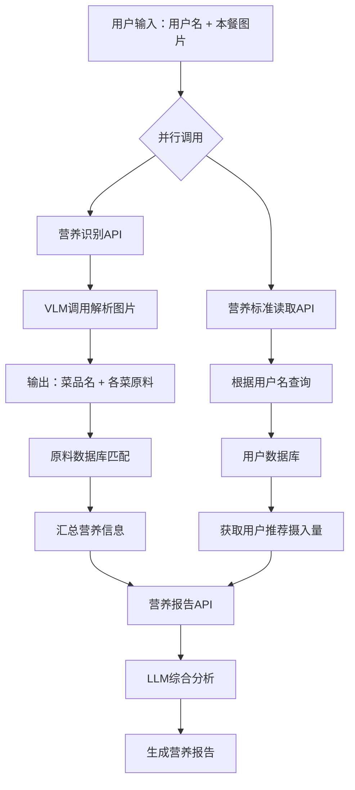

# 项目概览 - 福宝 (NutriBit)

## 🎯 项目愿景与使命

### 愿景 (Vision)
成为全球领先的、以AI视觉识别为核心的个性化健康生活方式管理平台

### 使命 (Mission)
赋能每一个人，通过简单、智能、持续的饮食记录与引导，构建长久、可持续的健康生活

## 📊 市场机会与问题

### 行业痛点
1. **营养记录复杂**: 传统营养记录需要手动输入，过程繁琐
2. **数据不准确**: 油盐酱醋等调料难以精确计量
3. **中式饮食适配差**: 现有产品主要针对西式饮食设计
4. **缺乏个性化**: 千篇一律的建议，无法满足个体差异

### 我们的解决方案
- **AI视觉识别**: 拍照即可识别菜品和营养成分
- **智能微调系统**: 用户参与优化，提升数据准确性
- **中式饮食数据库**: 专门适配中国人饮食习惯
- **个性化推荐**: 基于个人档案的定制化建议

## 🚀 产品发展阶段

### 阶段一：MVP (3-6个月)
**目标**: 核心价值验证，快速获取种子用户

#### 核心功能
1. **AI膳食识别与记录**
   - 拍照/上传识别菜品名称
   - 菜品分解与营养估算
   - 智能交互式估算系统

2. **基础个人健康档案**
   - 身高、体重、年龄、性别录入
   - 健康目标设定
   - 自动化营养需求计算

3. **即时营养分析报告**
   - 单餐营养报告
   - 每日营养汇总
   - 饮食习惯统计分析

#### 技术架构流程

### 阶段二：功能深化与社区构建 (6-12个月)
**目标**: 提升用户粘性，构建社区生态

#### 新增功能
1. **个性化膳食推荐**
   - 基于历史数据的智能推荐
   - 智能配餐功能

2. **AI标准菜谱系统**
   - 健康美味标准菜谱库
   - 一键营养导入
   - 可调节的个性化菜谱
   - UGC用户生成内容

3. **用户留存与激励体系**
   - AI管家拟人化交互
   - 美食社群平台
   - 游戏化机制设计

### 阶段三：商业生态与平台拓展 (1年后)
**目标**: 深化商业模式，拓展业务边界

#### 生态功能
1. **数据互联与智能硬件联动**
   - 健康数据平台打通
   - 智能硬件合作

2. **专业服务对接**
   - 在线营养师咨询
   - 定制化健康方案

3. **供应链整合**
   - 健康食材电商
   - 自有品牌产品

## 💡 核心创新功能

### 1. "一键跟吃"功能
- **概念**: 用户可以一键购买和记录KOL的同款健康餐食
- **价值**: 解决"吃什么"和"怎么做"的决策疲劳
- **实现**: 社交内容 + 供应链整合

### 2. 净菜配送闭环
- **特色**: 扫码即可精准记录营养数据
- **优势**: 彻底解决营养计量不准确问题
- **模式**: 从线上到线下的完整服务闭环

### 3. 智能微调系统
- **创新点**: 将"不精准"转化为"用户参与优化"的亮点
- **机制**: 
  - 场景选择: 家常菜/餐厅/食堂
  - 口味调整: 清淡/适中/重口味
  - 份量估算: 可视化参考标准

## 🎯 目标用户群体

### 主要用户画像
1. **健身爱好者** (25-35岁)
   - 有明确的营养需求
   - 愿意为专业服务付费
   - 社交分享意愿强

2. **健康意识觉醒者** (30-45岁)
   - 关注身体健康
   - 追求生活品质
   - 有一定消费能力

3. **职场白领** (25-40岁)
   - 生活节奏快
   - 需要便捷解决方案
   - 重视效率和结果

### 用户需求分析
- **功能需求**: 简单易用的营养记录工具
- **情感需求**: 获得专业指导和社区认同
- **社交需求**: 分享健康生活方式
- **便利需求**: 一站式健康管理解决方案

## 📈 核心指标与目标

### 产品指标
- **DAU**: 日活跃用户数
- **记录频次**: 用户每日记录餐食次数
- **识别准确率**: AI识别菜品准确率
- **用户满意度**: 营养建议满意度评分

### 商业指标
- **转化率**: 免费用户转付费用户比例
- **ARPU**: 单用户平均收入
- **复购率**: 净菜配送复购比例
- **LTV**: 用户生命周期价值

## 🌟 竞争优势

1. **技术优势**: 国内首款适合中式饮食的精准营养分析
2. **数据优势**: 专业的中式菜品营养数据库
3. **体验优势**: 智能微调 + 用户参与的创新交互
4. **生态优势**: 从内容到商品的完整服务闭环
5. **供应链优势**: 净菜配送的深度垂直整合

---

*文档版本: v1.0*  
*最后更新: 2025年9月10日*
