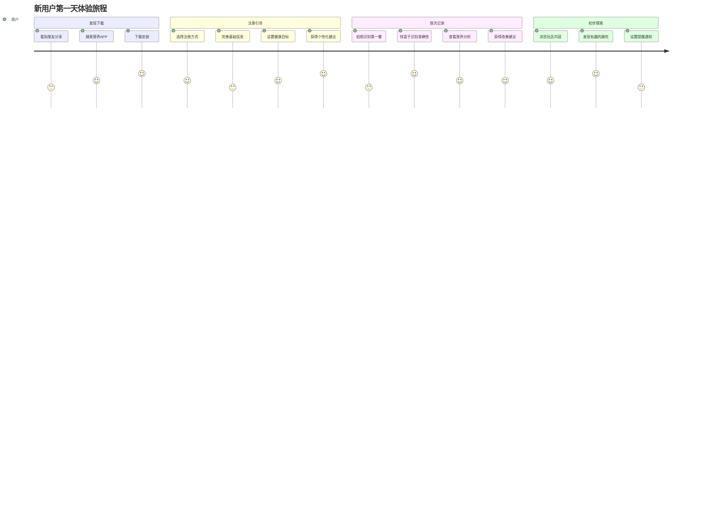
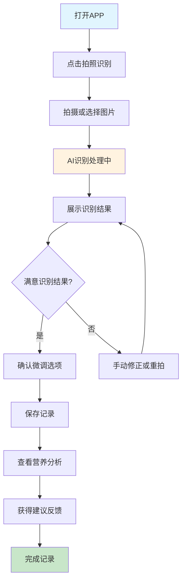
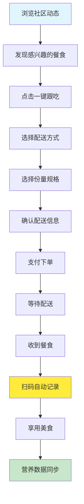

# 用户体验设计 - 福宝 (NutriBit)

## 🎯 用户体验愿景

创造一个简单、智能、有温度的健康饮食管理体验，让营养记录从"不得不做的事情"变成"享受的生活方式"。

### 设计原则
- **简单至上**: 复杂的技术，简单的体验
- **智能感知**: AI理解用户，而非用户适应AI
- **情感连接**: 有温度的健康指导，而非冷冰冰的数据
- **习惯养成**: 通过设计帮助用户建立健康习惯

## 👥 用户画像与需求

### 主要用户群体

#### 1. 健身爱好者 (35%)
```typescript
interface FitnessEnthusiast {
  demographics: {
    age: "25-35岁";
    income: "月收入8K-20K";
    lifestyle: "一周运动3-5次";
  };
  painPoints: [
    "不知道吃什么能配合训练效果",
    "计算营养素比例太复杂",
    "外食营养成分不清楚",
    "增肌减脂期饮食难控制"
  ];
  goals: [
    "精确控制营养摄入",
    "配合训练计划饮食",
    "看到身体变化数据",
    "分享健身饮食经验"
  ];
  behaviors: {
    usage: "每餐记录，关注蛋白质摄入";
    social: "喜欢分享训练和饮食成果";
    payment: "愿意为专业功能付费";
  };
}
```

#### 2. 减脂瘦身者 (30%)
```typescript
interface WeightLosser {
  demographics: {
    age: "28-45岁";
    gender: "女性为主(70%)";
    motivation: "体重管理、外形改善";
  };
  painPoints: [
    "不知道怎么吃能健康减脂",
    "节食容易反弹",
    "外食热量难估算",
    "缺乏持续动力"
  ];
  goals: [
    "科学控制热量摄入",
    "保持营养均衡",
    "建立健康饮食习惯",
    "获得社群支持"
  ];
  behaviors: {
    usage: "关注热量和体重变化";
    social: "需要鼓励和陪伴";
    payment: "对效果明显的服务愿意付费";
  };
}
```

#### 3. 健康意识觉醒者 (25%)
```typescript
interface HealthConsciousUser {
  demographics: {
    age: "30-50岁";
    lifestyle: "白领、中产家庭";
    concern: "长期健康、家庭营养";
  };
  painPoints: [
    "不确定日常饮食是否健康",
    "家庭成员营养需求不同",
    "缺乏专业营养知识",
    "工作忙碌难以坚持"
  ];
  goals: [
    "了解饮食营养状况",
    "改善家庭饮食结构",
    "预防疾病风险",
    "提升生活质量"
  ];
  behaviors: {
    usage: "定期记录，关注营养平衡";
    social: "偏向学习型内容";
    payment: "为全家健康愿意投资";
  };
}
```

## 🗺️ 用户旅程地图

### 新用户旅程

#### 第一天：首次体验


#### 第1-7天：习惯培养期
**目标**: 让用户养成记录习惯，体验核心价值

**关键触点设计**:
1. **智能提醒**: 餐时温馨提醒，非强迫性
2. **快速记录**: 30秒完成一次记录
3. **即时反馈**: 记录后立即获得分析和建议
4. **成就感**: 连续记录天数、营养目标达成

#### 第1-4周：价值验证期
**目标**: 用户看到明显的健康改善，决定长期使用

**关键功能**:
- 每周营养报告
- 体重变化趋势
- 饮食习惯改善对比
- 个性化建议精准度提升

#### 第1-3月：深度参与期
**目标**: 用户成为产品的忠实用户和传播者

**深度功能**:
- 参与社区互动
- 尝试跟吃功能
- 考虑付费升级
- 推荐给朋友

### 核心功能用户流程

#### AI识别记录流程


#### 一键跟吃流程


## 🎨 界面设计系统

### 视觉设计语言

#### 品牌色彩
```css
/* 主品牌色 - 清新绿 */
--primary-color: #2E7D32;      /* 健康、自然 */
--primary-light: #4CAF50;      /* 积极、生机 */
--primary-dark: #1B5E20;       /* 稳重、专业 */

/* 辅助色彩 */
--secondary-color: #FF9800;    /* 温暖、活力 */
--accent-color: #03DAC6;       /* 科技、智能 */
--success-color: #4CAF50;      /* 成功、达成 */
--warning-color: #FF9800;      /* 注意、警告 */
--error-color: #F44336;        /* 错误、危险 */

/* 中性色阶 */
--text-primary: #212121;       /* 主要文字 */
--text-secondary: #757575;     /* 次要文字 */
--text-hint: #BDBDBD;          /* 提示文字 */
--background: #FAFAFA;         /* 背景色 */
--surface: #FFFFFF;            /* 卡片背景 */
```

#### 字体系统
```css
/* 字体族 */
--font-family-primary: 'SF Pro Display', 'PingFang SC', sans-serif;
--font-family-secondary: 'SF Pro Text', 'PingFang SC', sans-serif;

/* 字体大小 */
--font-size-headline: 28px;    /* 页面标题 */
--font-size-title: 22px;       /* 卡片标题 */
--font-size-subtitle: 18px;    /* 子标题 */
--font-size-body: 16px;        /* 正文 */
--font-size-caption: 14px;     /* 说明文字 */
--font-size-small: 12px;       /* 小字 */

/* 字重 */
--font-weight-light: 300;
--font-weight-regular: 400;
--font-weight-medium: 500;
--font-weight-bold: 700;
```

#### 间距系统
```css
/* 8px 网格系统 */
--spacing-xs: 4px;
--spacing-sm: 8px;
--spacing-md: 16px;
--spacing-lg: 24px;
--spacing-xl: 32px;
--spacing-xxl: 48px;

/* 圆角 */
--border-radius-sm: 4px;
--border-radius-md: 8px;
--border-radius-lg: 12px;
--border-radius-xl: 16px;
--border-radius-round: 50%;
```

### 组件设计规范

#### 按钮组件
```tsx
// 主要按钮 - 关键操作
<Button variant="primary" size="large">
  开始记录
</Button>

// 次要按钮 - 辅助操作  
<Button variant="secondary" size="medium">
  查看详情
</Button>

// 文字按钮 - 轻量操作
<Button variant="text" size="small">
  跳过
</Button>

// 状态设计
const buttonStates = {
  default: { background: '--primary-color' },
  hover: { background: '--primary-dark' },
  pressed: { background: '--primary-dark', scale: 0.98 },
  disabled: { background: '--text-hint', cursor: 'not-allowed' }
}
```

#### 卡片组件
```tsx
// 营养记录卡片
<NutritionCard>
  <CardImage src={mealImage} />
  <CardContent>
    <CardTitle>午餐 · 12:30</CardTitle>
    <NutritionSummary calories={450} protein={25} />
    <CardActions>
      <Button variant="text">编辑</Button>
      <Button variant="text">分享</Button>
    </CardActions>
  </CardContent>
</NutritionCard>

// 卡片阴影层次
const cardShadows = {
  level1: '0 1px 3px rgba(0,0,0,0.12)',
  level2: '0 4px 6px rgba(0,0,0,0.12)',
  level3: '0 8px 12px rgba(0,0,0,0.15)'
}
```

### 交互设计规范

#### 动画系统
```css
/* 缓动函数 */
--ease-in-out: cubic-bezier(0.4, 0, 0.2, 1);
--ease-out: cubic-bezier(0.0, 0, 0.2, 1);
--ease-in: cubic-bezier(0.4, 0, 1, 1);

/* 动画时长 */
--duration-short: 150ms;
--duration-medium: 250ms;
--duration-long: 350ms;

/* 常用动画 */
.fade-in {
  animation: fadeIn var(--duration-medium) var(--ease-out);
}

.slide-up {
  animation: slideUp var(--duration-medium) var(--ease-out);
}

.scale-in {
  animation: scaleIn var(--duration-short) var(--ease-out);
}
```

#### 反馈设计
```tsx
// 加载状态
<LoadingSpinner message="AI正在识别中..." />

// 成功反馈
<Toast type="success" message="记录保存成功！" />

// 错误处理
<ErrorState 
  title="识别失败"
  message="请重新拍摄或手动输入"
  action="重试"
/>

// 空状态
<EmptyState
  icon="📱"
  title="还没有记录哦"
  subtitle="拍照记录你的第一餐吧"
  action="立即记录"
/>
```

## 📱 界面布局设计

### 主要页面布局

#### 首页 - 今日概览
```
┌─────────────────────────────────┐
│ ⚡ 福宝        🔔 📊 👤         │
├─────────────────────────────────┤
│ 👋 早上好，张三                   │
│ 今日营养摄入 • 65% 已完成          │
│                                 │
│ ┌─────────────────────────────┐  │
│ │ 📷 拍照识别                  │  │
│ │ 记录你的美食时刻              │  │
│ └─────────────────────────────┘  │
│                                 │
│ 📊 今日营养概览                  │
│ ╭─────╮ ╭─────╮ ╭─────╮        │
│ │1250 │ │ 85g │ │160g │        │
│ │ 大卡│ │蛋白质│ │碳水 │        │
│ ╰─────╯ ╰─────╯ ╰─────╯        │
│                                 │
│ 🍽️ 今日餐食记录                  │
│ [早餐卡片] [午餐卡片] [+加餐]     │
│                                 │
│ 💡 智能建议                      │
│ "今天蛋白质摄入充足，晚餐可以..."  │
└─────────────────────────────────┘
```

#### 记录页面 - AI识别
```
┌─────────────────────────────────┐
│ ← 拍照识别              ⚙️      │
├─────────────────────────────────┤
│                                 │
│ ┌─────────────────────────────┐  │
│ │                             │  │
│ │      📸 相机预览区域          │  │
│ │                             │  │
│ │          [拍照按钮]          │  │
│ └─────────────────────────────┘  │
│                                 │
│ 💡 拍摄小贴士                    │
│ • 光线充足，避免阴影              │
│ • 食物完整展示在画面中            │
│ • 可以放置硬币做参照物            │
│                                 │
│ [从相册选择]  [手动输入]          │
│                                 │
│ 🔥 最近识别                      │
│ [宫保鸡丁] [西红柿炒蛋] [米饭]    │
└─────────────────────────────────┘
```

#### 社区页面 - 内容发现
```
┌─────────────────────────────────┐
│ 🌟 发现好食光           🔍      │
├─────────────────────────────────┤
│ [推荐] [关注] [一键跟吃] [附近]  │
│                                 │
│ ┌─────────────────────────────┐  │
│ │ @健身达人小李 • 2小时前       │  │
│ │ ┌─────────┐ 今日减脂午餐     │  │
│ │ │ [餐食图] │ 高蛋白低碳水     │  │
│ │ └─────────┘ 380大卡|35g蛋白  │  │
│ │ ❤️125  💬32  ↗️18  🍽️45     │  │
│ │            [一键跟吃 ¥28]    │  │
│ └─────────────────────────────┘  │
│                                 │
│ ┌─────────────────────────────┐  │
│ │ @营养师小美 • 5小时前         │  │
│ │ 秋季养生汤推荐 🍲             │  │
│ │ [视频封面]                   │  │
│ │ ❤️89   💬15   ↗️12          │  │
│ └─────────────────────────────┘  │
└─────────────────────────────────┘
```

## 🎮 用户引导与教育

### 新手引导流程

#### 欢迎引导
```typescript
interface OnboardingSteps {
  welcome: {
    title: "欢迎来到福宝";
    subtitle: "AI智能营养管理，让健康更简单";
    action: "开始体验";
  };
  
  profileSetup: {
    title: "告诉我们一些关于你的信息";
    steps: [
      "基础信息 (身高、体重、年龄)",
      "健康目标 (减脂、增肌、维持)",
      "生活习惯 (运动频率、工作性质)",
      "饮食偏好 (口味、禁忌、过敏)"
    ];
  };
  
  firstRecord: {
    title: "记录你的第一餐";
    steps: [
      "拍照识别演示",
      "营养分析查看",
      "智能建议体验"
    ];
  };
  
  completion: {
    title: "太棒了！";
    subtitle: "你已经完成了第一次记录";
    rewards: ["获得新手徽章", "解锁每日任务"];
  };
}
```

#### 功能引导
```tsx
// 气泡提示组件
<Tooltip 
  content="点击这里可以手动调整识别结果"
  position="bottom"
  trigger="hover"
/>

// 操作引导
<GuideMask
  steps={[
    { target: '.camera-button', content: '点击拍照记录餐食' },
    { target: '.nutrition-chart', content: '这里显示营养分析结果' },
    { target: '.suggestion-panel', content: 'AI给出的个性化建议' }
  ]}
/>

// 渐进式披露
<ProgressiveDisclosure
  basic={['拍照', '记录', '分析']}
  advanced={['微调', '分享', '跟吃']}
  expert={['数据导出', 'API集成']}
/>
```

### 用户教育策略

#### 营养知识科普
- **每日一题**: 简单的营养知识问答
- **迷你课程**: 3分钟营养小知识
- **互动教学**: 游戏化学习营养搭配
- **专家直播**: 营养师在线答疑

#### 习惯养成指导
```typescript
interface HabitFormation {
  // 21天习惯养成计划
  challenges: [
    {
      name: "记录新手";
      duration: 7;
      goal: "连续7天记录三餐";
      rewards: ["记录达人徽章", "高级功能试用"];
    },
    {
      name: "营养平衡师";
      duration: 14;
      goal: "14天内营养均衡达标";
      rewards: ["营养师认证", "专属头像框"];
    },
    {
      name: "健康生活家";
      duration: 21;
      goal: "21天健康饮食习惯";
      rewards: ["生活家称号", "专属功能解锁"];
    }
  ];
  
  // 智能提醒系统
  reminders: {
    mealTime: "温馨提醒: 该记录午餐啦 🍽️";
    achievement: "太棒了! 连续记录7天，获得新徽章 🏆";
    suggestion: "今天蛋白质还差20g，推荐你试试这道菜 👨‍🍳";
  };
}
```

## 🎯 用户留存策略

### 游戏化元素

#### 成就系统
```typescript
interface AchievementSystem {
  badges: [
    { name: "记录新手", requirement: "完成首次记录" },
    { name: "连击达人", requirement: "连续记录7天" },
    { name: "营养专家", requirement: "营养目标达成率>90%" },
    { name: "社区之星", requirement: "发布内容获得100个赞" },
    { name: "跟吃达人", requirement: "尝试10次一键跟吃" }
  ];
  
  levels: {
    beginner: { xp: 0, perks: ["基础功能"] },
    intermediate: { xp: 1000, perks: ["高级分析"] },
    advanced: { xp: 5000, perks: ["专属客服"] },
    expert: { xp: 10000, perks: ["内测权限"] }
  };
  
  dailyTasks: [
    { task: "记录早餐", xp: 10 },
    { task: "记录午餐", xp: 10 },
    { task: "记录晚餐", xp: 10 },
    { task: "社区互动", xp: 5 },
    { task: "完成营养目标", xp: 20 }
  ];
}
```

#### 社交激励
- **排行榜**: 好友间的健康积分排行
- **组队挑战**: 多人协作完成健康目标
- **分享奖励**: 分享内容获得积分奖励
- **互助系统**: 好友间互相监督鼓励

### 个性化体验

#### 智能推荐
```typescript
interface PersonalizationEngine {
  userPreferences: {
    cuisineTypes: string[];     // 菜系偏好
    cookingMethods: string[];   // 烹饪方式
    ingredientLikes: string[];  // 喜爱食材
    dietaryRestrictions: string[]; // 饮食限制
  };
  
  behaviorAnalysis: {
    mealTiming: Date[];         // 用餐时间规律
    portionSizes: number[];     // 份量偏好
    nutritionFocus: string[];   // 关注的营养素
    socialActivity: number;     // 社交活跃度
  };
  
  recommendations: {
    meals: Recipe[];            // 推荐菜谱
    content: Post[];            // 推荐内容
    products: Product[];        // 推荐商品
    goals: Goal[];              // 推荐目标
  };
}
```

#### 内容个性化
- **Feed流算法**: 基于兴趣推荐内容
- **通知策略**: 个性化推送时间和内容
- **界面适配**: 根据使用习惯调整界面
- **功能推荐**: 智能推荐适合的新功能

## 📊 体验度量体系

### 关键用户体验指标

#### 易用性指标
```typescript
interface UsabilityMetrics {
  taskCompletionRate: number;    // 任务完成率
  timeToComplete: number;        // 完成时间
  errorRate: number;             // 错误率
  learnability: number;          // 学习曲线
  
  // 具体场景
  scenarios: {
    firstRecord: {
      completionRate: 0.85;      // 85%用户完成首次记录
      avgTime: 180;              // 平均3分钟
      dropOffPoints: string[];   // 主要流失点
    };
    
    aiRecognition: {
      accuracy: 0.87;            // 87%识别准确率
      userSatisfaction: 0.82;    // 82%用户满意度
      retryRate: 0.15;           // 15%重试率
    };
  };
}
```

#### 参与度指标
```typescript
interface EngagementMetrics {
  dailyActiveUsers: number;      // 日活用户
  sessionLength: number;         // 平均使用时长
  screenViews: number;           // 页面浏览数
  featureAdoption: Record<string, number>; // 功能采用率
  
  retention: {
    day1: 0.75;                  // 次日留存75%
    day7: 0.45;                  // 7日留存45%
    day30: 0.25;                 // 30日留存25%
  };
  
  engagement: {
    recordingFrequency: 2.1;     // 平均每日记录2.1次
    socialInteraction: 0.3;      // 30%用户参与社交
    premiumConversion: 0.08;     // 8%付费转化率
  };
}
```

### 用户反馈收集

#### 定量反馈
- **应用内评分**: 每次关键操作后的快速评分
- **NPS调研**: 定期净推荐值调研
- **满意度调查**: 功能满意度量表
- **A/B测试**: 不同设计方案的效果对比

#### 定性反馈
```typescript
interface QualitativeFeedback {
  methods: [
    "用户访谈",
    "可用性测试",
    "焦点小组",
    "社区反馈",
    "客服记录"
  ];
  
  insights: [
    "用户期望更快的识别速度",
    "希望有更多本地化菜品支持",
    "需要更简单的分享功能",
    "希望增加家庭成员管理"
  ];
  
  actionItems: [
    "优化AI模型推理速度",
    "扩充中式菜品数据库",
    "简化分享流程设计",
    "开发家庭版功能"
  ];
}
```

## 🔮 未来体验创新

### 新兴技术应用

#### AR增强现实
- **营养可视化**: AR显示食物营养成分
- **份量识别**: AR测量食物体积重量
- **虚拟营养师**: AR虚拟形象互动指导
- **餐厅菜单**: AR扫描菜单显示营养信息

#### 语音交互
```typescript
interface VoiceInterface {
  commands: [
    "记录我刚吃的牛肉面",
    "今天的营养摄入怎么样？",
    "推荐一道高蛋白的菜",
    "设置明天的用餐提醒"
  ];
  
  responses: {
    natural: "今天的蛋白质摄入很棒，已经达到目标的85%了！";
    contextual: "基于你的健身计划，推荐试试蒜蓉西兰花炒虾仁";
    proactive: "距离晚餐时间还有1小时，要不要先看看今天推荐的菜谱？";
  };
}
```

#### 智能穿戴集成
- **实时监测**: 血糖、心率等生理指标
- **运动关联**: 运动量与营养需求动态调整
- **睡眠影响**: 睡眠质量对饮食建议的影响
- **压力管理**: 压力水平与饮食习惯的关联

### 个性化AI助手

#### 情感化交互
```typescript
interface EmotionalAI {
  personality: {
    traits: ["友善", "专业", "幽默", "关怀"];
    communication: "温暖而不失专业";
    adaptability: "根据用户状态调整语调";
  };
  
  scenarios: {
    encouragement: "连续记录7天了，你真棒！今天也要加油哦 💪";
    concern: "最近好像蔬菜吃得少了，要不要试试这道爽口凉菜？";
    celebration: "目标达成啦！🎉 要不要分享一下你的成功秘诀？";
    comfort: "偶尔放纵一下也没关系，明天我们一起重新开始！";
  };
}
```

---

*文档版本: v1.0*  
*最后更新: 2025年9月10日*
