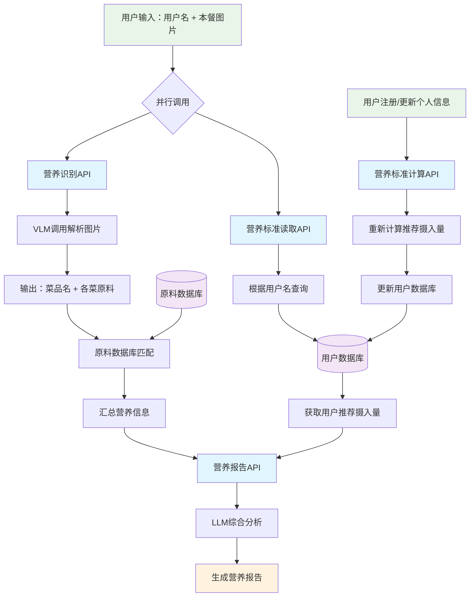

# 食刻 - 精准营养解码，预见更健康的你

项目愿景 (Vision)： 成为全球领先的、以AI视觉识别为核心的个性化健康生活方式管理平台。
项目使命 (Mission)： 赋能每一个人，通过简单、智能、持续的饮食记录与引导，构建长久、可持续的健康生活。

---

## 第一部分：产品功能架构 (从MVP到完整生态)

我们将采用分阶段实施的策略，从核心功能（MVP）开始，逐步迭代，构建功能护城河和用户生态。

### 阶段一：MVP (Minimum Viable Product) - 核心价值验证期 (预计3-6个月)

此阶段的目标是快速上线，验证核心功能，并吸引种子用户。

1. 核心功能：AI膳食识别与记录

- 拍照/上传识别： 用户通过拍照或上传图片，AI快速识别出菜品名称。
- 菜品分解与营养估算：
  - 技术核心： 调用你已有的“菜品分解->原料数据库匹配->营养汇总”模型。
  - 痛点解决方案 (油盐糖不准问题)： 这是我们超越竞品的关键！放弃不切实际的硬件方案，采用“AI估算 + 用户微调”的软件解决方案。
    - 智能交互式估算： AI识别出“青椒炒肉”后，会给出一个基于大数据的“标准版”营养成分。同时，会弹出几个关键选项让用户选择，例如：
      - 场景选择： [家常菜] [餐厅/外卖] [食堂] (AI会根据不同场景的平均用油盐量调整基准值)
      - 口味调整： [清淡] [适中] [重口/偏咸/偏油]
      - 份量估算： 提供可视化参考，如 [小份(约1拳)] [中份(约2拳)] [大份]
    - 优势： 这个方案将“不精准”的弱点，转化为了一个“用户参与、持续优化”的亮点。用户每次微调，都在为我们的AI模型提供宝贵的训练数据，让估算越来越准。这对于两类人群都适用：入门用户选个大概就行，精准用户可以根据自己的判断微调。

2. 基础功能：个人健康档案

- 信息录入： 身高、体重、年龄、性别、运动习惯（轻度/中度/重度）。
- 健康目标： [减脂] [增肌] [维持健康] [特定营养素关注(如低钠/高蛋白)]。
- 自动化计算： 根据档案和目标，自动计算每日推荐的卡路里、三大营养素（碳水、蛋白质、脂肪）的摄入量范围。

3. 核心反馈：即时营养分析报告

- 单餐报告： 记录一餐后，立即生成图文并茂的报告。用红绿灯或评分（如85分）的形式，直观告诉入门用户“这顿饭怎么样”，并简单说明原因（如“蛋白质充足，但脂肪略高哦”）。
- 每日报告： 汇总全天饮食，与个人目标进行对比，清晰展示达标情况和超标/不足的营养素。
- 饮食习惯统计：当收集到了足够多顿的饮食数据后，分析用户的饮食习惯，并给出改善意见。

本阶段的核心流程如下:

### 阶段二：功能深化与社区构建期 (MVP上线后6-12个月)

此阶段目标是提升用户粘性，并开始构建社区生态。

1. 个性化膳食推荐 (解决“吃什么”的难题)

- 基于历史数据的推荐： 分析用户的饮食偏好（如喜欢鸡肉、不爱吃胡萝卜），结合当日营养缺口，推荐具体的菜品。例如：“今天蛋白质还差20克，晚餐推荐尝试一下我们的‘蒜蓉西兰花炒虾仁’食谱哦！”
- 智能配餐功能： 用户可以选择 [生成一日三餐]，AI会根据他的健康目标和口味偏好，自动生成一份营养均衡的食谱。

2. “AI标准菜谱”功能 (解决“怎么做”的难题)

- 这不是行业标准，而是“健康美味标准”： 我们不做“正宗”的定义者，而是“健康”的倡导者。
- 功能设计：
  - 海量菜谱库： 包含家常菜、健身餐、宝宝辅食等。
  - “一键营养导入”： 用户选择一个菜谱，所有食材和调味料的用量都已预设好，用户跟着做，做完后可以直接一键记录，得到最精准的营养数据。
  - 可调节的菜谱： 用户可以根据自己的口味调整菜谱中的食材用量（如“少放1克盐”），系统会实时重新计算营养成分。
  - UGC (用户生成内容)： 鼓励用户上传自己的健康菜谱，形成社区内容生态。
  -

3. 用户留存与激励体系 (解决“如何持续使用”的难题)

- AI管家：
  - 拟人化形象： 设计一个可爱的AI形象（如一只叫“卡卡”的营养师小浣熊）。
  - 智能对话与关怀： AI会主动发起对话，如“主人，你今天蔬菜吃得不够哦~”、“昨晚的聚餐很棒，今天我们吃清淡点来平衡一下吧！”。它不仅是数据分析师，更是有温度的伙伴。
- 美食社群：
  - 功能： 用户可以分享自己的每日三餐图片、分享自己做的健康菜、提问、交流心得。
  - 氛围： 打造一个积极、互助、鼓励的社区氛围，而不是一个贩卖身材焦虑的地方。
- 游戏化机制 (Gamification)：✅ **已完成设计** - [查看详细文档](docs/gamification-design.md)
  - 打卡与连击： 连续记录天数，获得徽章和成就。
  - 美食地图/美食护照： 记录吃过的不同菜品，点亮全国/全球美食地图，满足用户的收集和探索欲。
  - 健康挑战： 发起"7天低卡挑战"、"21天健康饮食习惯养成"等活动，用户组队参与，增加互动和趣味性。
  - **新增功能**：
    - 用户成长系统 (1-50级等级体系，经验值机制)
    - 多维度成就系统 (8大类别，100+ 成就)
    - AI伙伴"卡卡"营养师 (智能对话与情感支持)
    - 社交互动机制 (好友系统、排行榜、社区互动)
    - 个性化奖励系统 (基于用户行为模式的智能奖励)
    - 季节性活动与长期任务线
    - 完整的技术实现方案与数据架构
  
### 阶段三：商业生态与平台拓展期 (上线1年后)

此阶段目标是深化商业模式，并拓展业务边界。

1. 数据互联与智能硬件联动：

- 数据打通： 与Apple Health, Google Fit, 华为运动健康等平台打通，导入步数、睡眠、心率等数据，进行更全面的健康分析。
- 智能硬件合作： 与智能体脂秤、手环等厂商合作，数据自动同步。此时再考虑与智能厨电（如智能烤箱、空气炸锅）合作，我们的菜谱可以直接发送指令给厨电，实现“一键烹饪”。

2. 专业服务对接：

- 在线营养师咨询： 为有深度需求的用户提供付费的一对一营养师咨询服务。我们可以与营养师机构合作，平台进行抽成。
- 定制化健康方案： 推出由专业营养师团队打造的、针对特定人群（如孕妇、术后恢复、糖尿病患者）的付费高级饮食计划。

3. 供应链整合：

- 健康食材电商： 在菜谱页面，提供“一键购买食材”功能，与京东到家、叮咚买菜等生鲜电商合作，赚取导流佣金。
- 自有品牌/联名品牌： 推出符合我们健康标准的轻食、代餐、健康零食等产品。

---

## 第二部分：商业模式 (如何赚钱)

一个健康的商业模式是项目持续发展的血液。我们采用多元化的混合模式。

1. Freemium (基础免费 + 增值订阅)

- 免费版： 提供核心的AI识别、基础记录、每日简报功能。目的是最大化获取用户。
- 付费订阅版 (会员)：
  - 月度/季度/年度订阅。
  - 会员权益：
    - 无限次AI识别 (免费版可能限制每日次数)。
    - 高级数据报告： 周报、月报、年度健康趋势分析、微量元素分析等。
    - 高级个性化功能： 无限制使用智能配餐、定制化健康目标等。
    - 解锁全部“AI标准菜谱”。
    - 无广告。
    - 专属AI伙伴皮肤和语音包。

2. B2B 企业服务

- 企业健康解决方案： 为企业提供员工健康管理服务。企业统一采购，员工使用。后台可以为企业提供匿名的员工整体健康数据报告，作为企业福利和文化建设的一部分。
- 赋能健身房/健康管理机构： 为健身房的教练、营养师提供专业的管理工具，他们可以用我们的软件为自己的客户制定和追踪饮食计划。我们收取SaaS服务费。

3. 增值服务与佣金

- 专业咨询付费： 用户为营养师一对一咨询付费，平台抽成。
- 电商导流佣金： 通过菜谱功能引导用户购买食材、厨具等，赚取佣金。

4. 数据洞察服务 (远期规划)

- 在严格遵守数据隐私法规的前提下，将脱敏和聚合后的用户饮食趋势数据，提供给食品行业公司、市场研究机构，用于产品研发和市场分析。（注意：此项业务必须在用户基数巨大且品牌信誉极高时才考虑，且必须对用户高度透明）。

---

## 功能升级：从菜谱到餐桌——净菜配送

我们不再仅仅是“告诉”用户怎么吃，我们直接“提供”给他们健康、便捷的食材。

### 功能设计与用户旅程 (User Journey)

1. 无缝嵌入菜谱： 在每一个我们官方出品的“AI标准菜谱”页面，除了烹饪步骤外，都有一个极其醒目的按钮：“一键购买食材包”。
2. 个性化选择： 用户点击后，可以选择份量（例如：[一人食] [两人温馨餐] [三口之家]）。系统会自动计算好价格。
3. 透明展示： 页面会清晰展示食材包内含的所有内容：XX克有机青椒、XX克认证猪里脊、XX克特级大蒜，以及我们独家配比的、标注了克数的低钠酱料包。所有食材均附有“有机/无公害”认证标识。
4. 一键下单，即时配送： 用户确认地址后，通过内置的支付系统完成购买。我们与即时物流合作（或自建配送团队），确保在承诺时间内将新鲜的净菜包送达用户手中。
5. 闭环的终极体验——“扫码秒记”：

- 这是杀手级功能！ 每个净菜包上都有一个专属的二维码。
- 用户烹饪完成后，无需拍照识别，只需打开我们的App扫描这个二维码，这一餐100%精准的营养数据（精确到每一克食材和调料）就会被瞬间、完美地记录到他的健康档案中！
- 这彻底解决了你最初提到的“油盐酱醋不准”的终极痛点，为用户提供了无与伦比的精准和便捷。

### 战略价值分析 (Why this is a Game-Changer)

1. 完成商业闭环，创造极致便利：

- 我们为用户解决了从“吃什么”（AI推荐）->“怎么做”（AI菜谱）-> “用什么做”（净菜配送） 的完整链条。这种一站式解决方案拥有极强的用户粘性。

2. 开辟核心收入来源，提升用户终身价值(LTV)：

- 相比于每月几十元的会员费，每周2-3次的净菜包购买，将使单个用户的价值提升10倍以上。这让我们的商业模式从“薄利多销”的软件订阅，升级为拥有高客单价、高复购率的“新消费品牌”。

3. 强化品牌信任，建立行业壁垒：

- 提供“无公害绿色有机”食材，完美契合了我们“长久健康才是真健康”的品牌理念。我们不再只是一个建议者，而是健康生活的实践提供者。
- 供应链和物流的整合是重资产、重运营的，一旦建立起来，会形成极高的竞争壁垒，纯互联网的竞争对手很难模仿。

4. 实现最精准的数据闭环：

- 通过“扫码秒记”，我们获得了用户饮食数据中最精准的“Ground Truth”（地面实况）。这些高质量的数据将反哺我们的AI模型，让我们的“拍照估算”功能对非标准餐食的估算也越来越准，形成一个良性循环。

### 执行规划 (Phased Rollout Plan)

直接在全国铺开净菜配送是不现实的。我们需要一个分阶段的、可验证的执行计划。

#### 阶段一：MVP - 城市试点期 (上线后6-9个月)

- 目标： 验证模式，跑通流程。
- 区域： 选择一个目标用户集中的城市（如北京、上海、杭州、深圳）的一个或几个核心区域（如科技园区、高端住宅区）开始试点。
- 产品： 精选10-20个最受欢迎的“AI标准菜谱”作为首批配送菜品。
- 供应链： 与你已有的有机农场资源深度绑定，建立一个小型、高效的净菜处理和包装中心。
- 物流： 不自建团队，与顺丰同城、闪送、达达等第三方即时物流平台合作，解决“最后一公里”配送问题。
- 核心指标： 关注下单转化率、复购率、客单价和用户满意度。

#### 阶段二：模式优化与扩张期 (试点成功后12-24个月)

- 目标： 扩大城市覆盖，优化供应链效率。
- 区域： 完整覆盖首个试点城市，并拓展到2-3个新的一线或新一线城市。
- 产品： 菜品SKU扩展到50-100个，并根据不同城市用户的口味偏好进行调整。推出主题系列，如“一周减脂餐包”、“家庭营养餐包”。
- 供应链： 在每个核心城市建立“前置仓”，缩短配送半径，提升配送时效和食材新鲜度。
- 物流： 在订单密度高的区域，可以开始尝试组建小规模的自营配送团队，以保证服务质量。

#### 阶段三：规模化与品牌化运营期 (2年后)

- 目标： 成为国内领先的健康餐食解决方案品牌。
- 区域： 覆盖全国主要一二线城市。
- 产品： 推出联名款、大师款菜谱包，并可拓展至半成品、健康饮品、代餐等品类。
- 品牌： 大力推广品牌，将其打造为“健康、有机、便捷”的代名词。

---

## “一键跟吃”方案

“一键跟吃”精准地捕捉到了当代消费者的两大核心心理：“信任代理” 和 “极致便利”。用户不再需要自己思考和决策，而是将自己的信任“代理”给他们认可的KOL（关键意见领袖）或健身达人，然后通过最简单的方式获得结果。

我们拥有净菜加工厂的资源，这让这个想法从一个空中的概念，变成了可以落地的、拥有坚实壁垒的商业模式。

项目代号： “灯塔计划” (Project Beacon)
核心理念： Follow the light, get fit right. (跟随灯塔，轻松健康)

### 一、 核心概念与用户价值

“一键跟吃”是一个深度整合了内容、社交与供应链的革命性功能。它允许用户在App内浏览他们关注的健康博主、健身教练、营养师甚至明星（以下统称KOL）的真实饮食记录，并一键下单购买同款的“净菜包”或“健康外卖”，餐食的精准营养数据将自动同步到用户的健康档案中。

为用户解决了终极痛点：

1. 决策疲劳： 彻底根除“今天吃什么、怎么吃才健康”的每日难题。
2. 执行障碍： 解决了“没时间买菜、做饭、计算营养”的巨大障碍。
3. 信任鸿沟： 用户不再相信泛泛的理论，而是相信一个活生生的、他们向往的榜样。他们要的不是“建议”，而是“结果”的复刻。

### 二、 功能设计与用户旅程 (The Magic Journey)

1. 内容发现 (Discovery)：

- 在App的社区/发现页，会有一个专门的“跟吃”频道。
- KOL发布的每日饮食动态会带有特殊的 “可跟吃” 标识。这条动态不仅仅是一张图片，而是一个与我们数据库关联的结构化数据。
- 例如，健身教练张三发布午餐：“今天练腿日，补充优质蛋白和碳水！”，配图是“黑椒鸡胸肉配藜麦饭”。

2. 一键触发 (One-Click)：

- 用户看到这条动态，图片下方有一个极其醒目的按钮 【一键跟吃TA的午餐】。
- 点击按钮，弹出一个简洁的下单页面。

3. 智能选项 (Smart Options)：

- 模式选择：
  - 【美味复刻】净菜包 (¥XX元)： 包含所有预处理好的新鲜食材和酱料，用户只需简单烹饪15分钟即可。适合享受轻烹饪乐趣的用户。
  - 【即享同款】健康餐 (¥YY元)： 由我们的中央厨房制作好的成品健康外卖，加热即食。适合极致便利追求者。
- 份量调整： 系统会默认推荐与KOL相同的份量，但用户可根据自身情况选择 [标准份] [增肌加量版(蛋白质+30%)] [减脂轻卡版(碳水-30%)]。价格会随之变动。
- 配送选择： 选择送达时间。

4. 无缝闭环 (Seamless Loop)：

- 用户完成支付，订单生成。
- 餐食送达后，系统将这顿饭100%精准的营养数据自动、即时地计入用户的当日营养记录中。无需任何拍照、扫描或手动输入。
- App会推送一条通知：“您已完成‘跟吃’张三的午餐，蛋白质摄入目标已完成70%！继续加油！”

### 三、 战略价值与商业飞轮

“一键跟吃”将构建一个强大的、自我强化的“商业飞轮”：

- 飞轮起点 -> 签约优质KOL：
  - 我们与自带流量和信任背书的KOL合作，为他们提供便捷的记录工具和可观的收入分成。
- 飞轮转动第一环 -> KOL创造内容：
  - KOL在App内分享自己的真实饮食，这些内容自带“可跟吃”的商业属性，是最高效的“种草”内容。
- 飞轮转动第二环 -> 用户“一键跟吃”并分享：
  - 粉丝出于信任和便利，下单购买。极致的体验促使用户在我们的社区或外部社交平台分享“今天我吃了和XX一样的午餐”，形成二次传播。
- 飞轮转动第三环 -> 供应链与数据驱动：
  - 大量的订单驱动我们的净菜加工厂和中央厨房规模化生产，降低成本。
  - 我们获得“哪个KOL的哪款餐最受欢迎”的宝贵数据，用于指导新品研发和优化供应链。
- 飞轮加速 -> 吸引更多KOL和用户：
  - 成功的KOL变现案例会吸引更多KOL入驻。海量的优质内容和独特的“跟吃”体验会吸引更多用户下载和使用App。飞轮越转越快，壁垒越来越高。

### 四、 执行方案与资源配置

1. 第一阶段：MVP试点 (3-6个月)

- KOL合作： 不求多，求精。首批签约5-10位垂直领域的KOL（如健身、减脂、瑜伽博主），深度合作，共同打磨产品。
- 产品线： 聚焦 “净菜包” 模式，充分利用你现有的工厂资源。精选20-30个核心SKU，确保品质和供应稳定。
- 运营： 集中在一个城市试点，跑通从KOL发布内容到用户下单、工厂生产、物流配送、数据记录的全流程。
- 技术： 重点开发App内的“跟吃”下单流程、与KOL的内容发布工具绑定、与订单和生产系统的数据打通。

2. 第二阶段：模式扩张 (6-12个月)

- 引入“健康外卖”： 在试点城市建立或合作一个高标准的中央厨房，上线“即享同款”健康餐选项，满足更广泛的用户需求。
- 扩大KOL矩阵： 建立标准化的KOL入驻和分成体系，吸引更多中腰部KOL加入。
- 城市扩张： 将跑通的模式复制到新的1-2个核心城市。

3. 第三阶段：生态深化

- 推出订阅制： “包月跟吃”服务。用户可以选择一位KOL，系统自动根据KOL的周/月度饮食计划，每日配送餐食。这是稳定现金流的利器。
- 打造明星KOL： 将我们的平台打造成健康领域的“MCN机构”，孵化我们自己的明星KOL，深度绑定。
- 数据产品： 基于海量精准的饮食消费数据，为食品行业提供趋势预测和产品研发指导。

### 五、 商业模式与盈利点

1. 核心收入：餐食销售。 这是主要的利润来源，毛利率远高于软件会员费。
2. KOL合作模式： 采用CPS（按销售额付费）的分成模式。KOL通过其影响力带来的每一笔订单，都能获得一定比例的佣金。这极大地激发了KOL的推广动力。
3. 订阅费： “包月跟吃”的预付费，提供折扣，锁定长期用户。
4. 平台佣金（远期）： 当平台壮大后，允许第三方健康食品品牌入驻，我们收取平台服务费和交易佣金。

不再是让用户“记录”健康，而是让用户“买到”健康。这是一种从“信息服务”到“实体服务”的跃迁，将彻底颠覆现有的健康管理和在线健身市场。

## 修改和优化建议

目前项目对于中后期讨论度较高，对于前期实际应用设想较为薄弱，目前市面上已经有了AI营养师的APP，面对评委时难以给出眼前一亮的感觉，针对此点给出以下看法：。

1. +国外AI识别主流为热量+营养，国内主流为热量，造成这一问题的关键可能是：国内外市场需求不同，国内对于健康饮食的观念尚未大规模普及；由于市场需求不同，国内几乎未针对营养分析推出成熟的商用相关模型/算法；也可能是由于国内菜品识别难度大，较为复杂。

2. +针对这样的现象，我们团队可以提出“国内首款”（简单查询了一下应该是首个）适合国内用餐习惯且较为成熟的热量+精确（体现在除了碳水、脂肪、蛋白质还有其他元素等）营养分析大模型（算法优化/数据库为国内的菜品）。通过“国内首款”、“适合国内”这样的较为有吸引力的词语让评委记忆深刻。（如果不是国内首款建议强调技术优化）

3. +前期的市场可以是针对传统简单的热量分析模型，也就是打造一个专业的热量分析模型PRO版本，相比国内增加了营养这一要素，不仅仅是从碳水、脂肪、蛋白质进行长期建议，更全面关注健康，相比于国外更加适合国内菜品。。

4. +前期合作可以是各个成熟的应用，比如KEEP，让他们的热量分析更加全面，直接节省了宣传费用，直接对接目标人群之一。前期最好是以小的成本达到大的成果，省去了APP开发、宣传等费钱的成本，让项目看起来更加真实，从“小而精”走向垂直领域生态的开拓者。。5.+以坚实的模型为基础，构建技术壁垒，逐步开拓社群服务（如配送菜品等），让评委认为项目有一个特色鲜明的点（国内首款/适合国内实际需求），并且有较为可靠的前期商业计划。。欢迎大家交流讨论。
